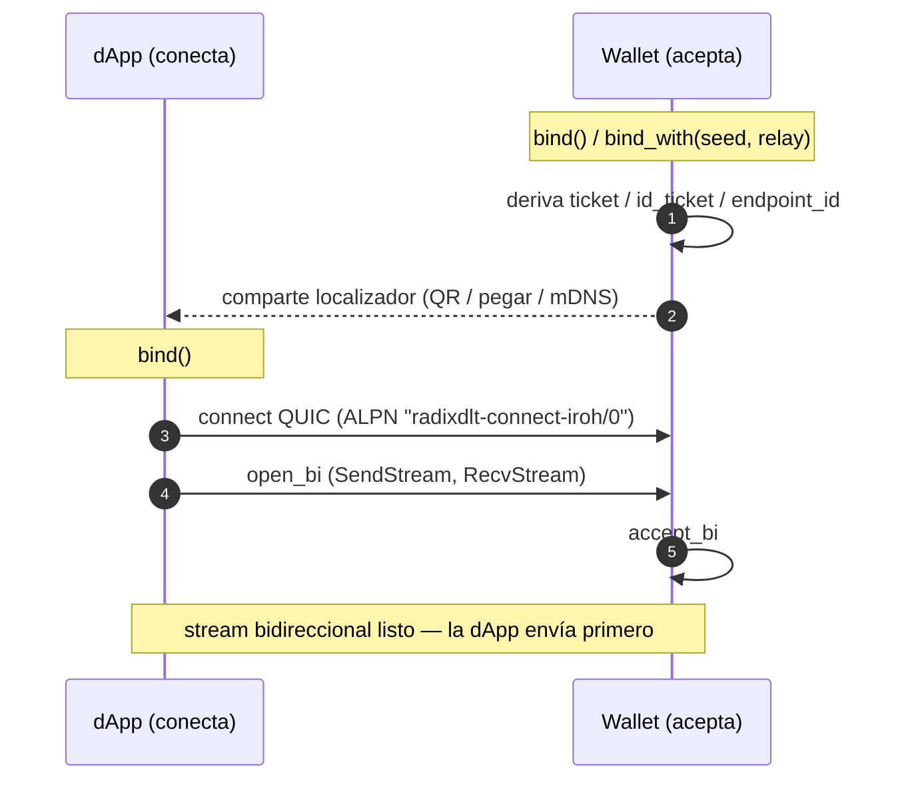
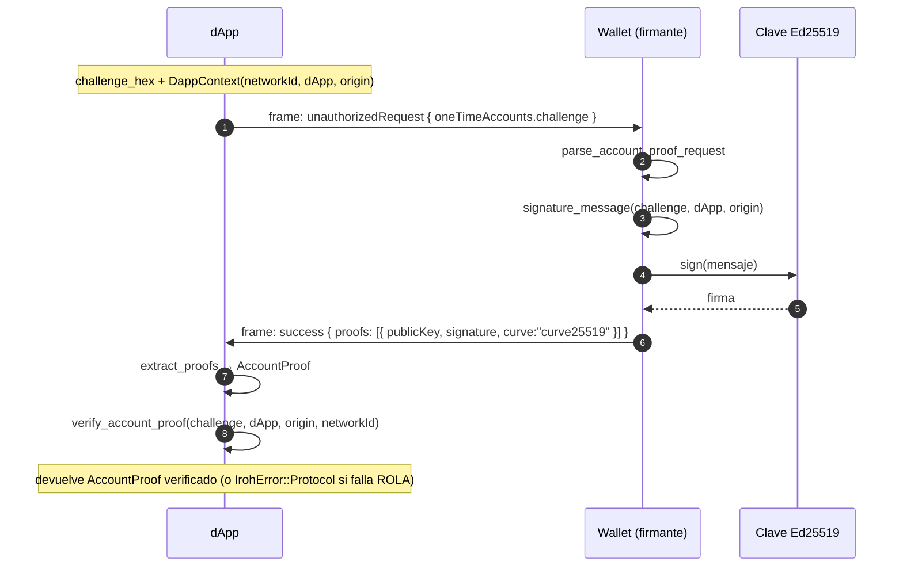
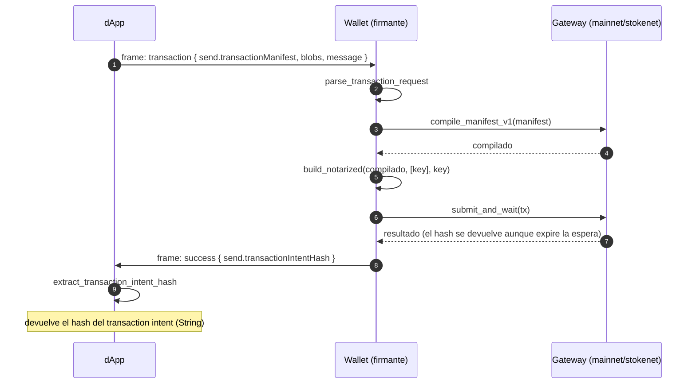
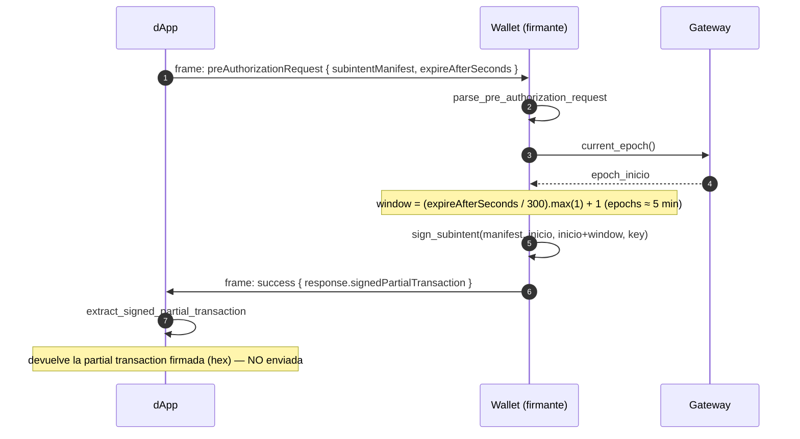
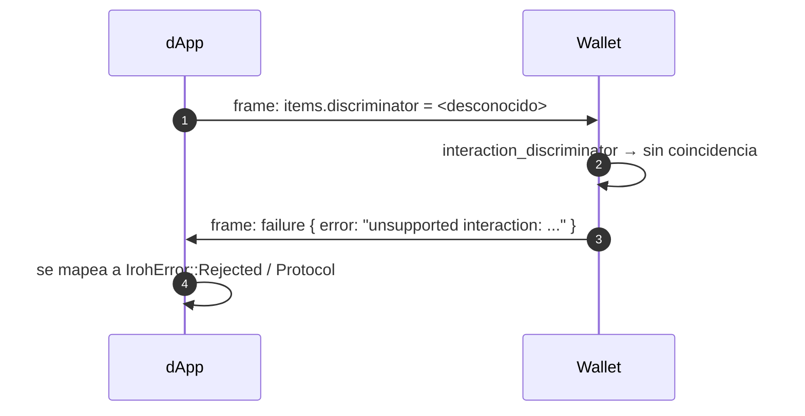

# radixdlt-connect-iroh — Especificación del protocolo de transporte

*[English](PROTOCOL.md) · **Español***

Versión: `radixdlt-connect-iroh/0` · Estado: refleja el código de
`crates/connect-iroh` (`src/lib.rs`, `src/protocol.rs`) y el esquema compartido
de interacción con la wallet en `crates/connect-types`.

Este documento especifica cómo dos peers Rust del SDK intercambian mensajes de
interacción de wallet Radix sobre el transporte [iroh](https://iroh.computer)
(QUIC). Es una alternativa al transporte WebRTC de `radixdlt-connect`; **no**
interopera con la wallet móvil de Radix (que solo habla Radix Connect sobre
WebRTC). Ambos extremos ejecutan el SDK —p. ej. un firmante de escritorio, un
servidor o un dispositivo— de modo que flujos como ROLA "iniciar sesión con
Radix" se ejecutan enteramente en Rust, sin teléfono.

---

## 1. Roles

| Rol | API | Comportamiento |
| --- | --- | --- |
| **dApp** | `IrohConnector::connect*` + `protocol::request_*` | Inicia la conexión QUIC, abre el stream, **envía la petición primero** y luego lee y (para ROLA) verifica de forma nativa la respuesta. |
| **Wallet** (firmante) | `IrohConnector::accept` + `protocol::Wallet::answer` | Acepta la conexión, **recibe la petición primero**, custodia la clave Ed25519 y responde la interacción. |

Ambos roles son simétricos a nivel de transporte (`IrohChannel` envía y recibe
en cualquier dirección); lo que los distingue es la regla de "quién envía
primero" descrita abajo.

---

## 2. Capa de transporte

- **Sustrato:** endpoints iroh 1.x sobre QUIC.
- **ALPN:** `radixdlt-connect-iroh/0` (constante `ALPN`, `src/lib.rs`). Un peer
  que negocie cualquier otro ALPN no participa en este protocolo.
- **Stream:** exactamente **un stream QUIC bidireccional** por interacción. El
  lado que conecta llama a `open_bi`; el que acepta llama a `accept_bi`.
- **Regla de direccionalidad:** el lado que **conecta** (dApp) escribe el primer
  mensaje; el lado que **acepta** (Wallet) lee primero. Este orden es el
  contrato que mantiene alineados petición/respuesta — no hay un mensaje de
  handshake explícito.

### 2.1 Encuadre (framing)

Cada mensaje es un único documento JSON (`serde_json::Value`) escrito en el
stream como un **frame con prefijo de longitud**:

```
┌────────────────────┬──────────────────────────────┐
│ longitud (u32, BE) │ cuerpo JSON (`longitud` bytes)│
│ 4 bytes            │ UTF-8, serde_json             │
└────────────────────┴──────────────────────────────┘
```

- `longitud` es el número de bytes del cuerpo JSON, `u32` big-endian.
- El lector hace `read_exact(4)` y luego `read_exact(longitud)` (`recv_message`).
- No se impone tamaño máximo en la capa de protocolo más allá del rango `u32`;
  aplica el control de flujo de QUIC.

### 2.2 Ciclo de vida de la conexión

1. La dApp resuelve la dirección de la Wallet (ver §3) y hace `connect` con el ALPN.
2. La dApp hace `open_bi` → obtiene `(SendStream, RecvStream)`; la Wallet hace `accept_bi`.
3. Se intercambian mensajes según el flujo de la interacción (§5).
4. Quien envía el último mensaje llama a `finish()` en su stream de envío para
   vaciar los datos; el peer llama a `close()` (código de cierre QUIC `0`,
   motivo `"done"`). `wait_closed()` bloquea hasta que la conexión se
   desmantela, lo que garantiza la entrega del último frame antes de descartar
   el endpoint.

---

## 3. Emparejamiento y descubrimiento

Un endpoint iroh se identifica por su `EndpointId` (su clave pública). Un peer
necesita el `EndpointId` de la Wallet y, salvo que el descubrimiento/relay lo
resuelva, al menos una dirección de transporte. El crate ofrece tres
localizadores:

| Localizador | Producido por | Contenido | Uso |
| --- | --- | --- | --- |
| **ticket** | `ticket()` | hex(JSON de `EndpointAddr` = id + direcciones de socket locales, IPs comodín mapeadas a loopback) | Emparejamiento en el mismo host / LAN (pegar o QR). Se consume con `connect_to_ticket`. |
| **id_ticket** | `id_ticket()` | hex(JSON de `EndpointAddr` = **solo** id, sin direcciones) | Hubs de internet con identidad persistente; el peer resuelve direcciones vía descubrimiento. Se consume con `connect_to_ticket`. |
| **endpoint id** | `endpoint_id_string()` / `endpoint_id_from_seed(seed)` | la cadena del `EndpointId` | Emparejamiento por mDNS / descubrimiento. Se consume con `connect_to_endpoint_id`. |

`endpoint_id_from_seed(&seed)` deriva el `EndpointId` **sin conexión** (sin
enlazar un endpoint), de modo que un localizador de hub puede imprimirse/
distribuirse por adelantado; enlazar la misma semilla de 32 bytes más tarde
produce el mismo id.

### 3.1 Identidad

- **Efímera** (`bind()` / `bind_with(None, …)`): una clave aleatoria nueva en cada ejecución.
- **Fija** (`bind_with(Some(seed), …)`): una semilla de 32 bytes → un
  `EndpointId` estable y un `id_ticket` estable entre reinicios. Los mismos 32
  bytes usados como clave de cuenta Radix unifican la identidad del canal y la
  del ledger.

### 3.2 Relay / accesibilidad

| Modo | Significado |
| --- | --- |
| `Relay::Disabled` | Solo conexiones directas (mismo host / LAN); sin relay ni descubrimiento. Preset `Minimal`, `RelayMode::Disabled`. |
| `Relay::Enabled` | Relays públicos n0 + descubrimiento; los peers tras NAT son accesibles por internet solo con el `EndpointId`. Preset `N0`. |

---

## 4. Formato de mensaje (capa de aplicación)

Las cargas JSON son el **mismo esquema de interacción de wallet** que usa el
transporte WebRTC, construido por `radixdlt-connect-types`. Peticiones y
respuestas son envolturas discriminadas.

### 4.1 Envoltura de petición

```json
{
  "interactionId": "<uuid-v4>",
  "metadata": {
    "version": 2,
    "networkId": <u8>,
    "dAppDefinitionAddress": "<account_...>",
    "origin": "<cadena de origen>"
  },
  "items": { "discriminator": "<tipo>", ... }
}
```

El **tipo de petición** es `items.discriminator`, leído por
`interaction_discriminator`:

| `items.discriminator` | Interacción |
| --- | --- |
| `unauthorizedRequest` / `authorizedRequest` | Prueba de cuenta (ROLA) / compartir cuenta |
| `transaction` | Firmar + enviar un manifiesto de transacción |
| `preAuthorizationRequest` | Firmar un subintent (pre-autorización) |

### 4.2 Envoltura de respuesta

```json
{ "discriminator": "success" | "failure", "interactionId": "<eco>", "items": { ... } }
```

- **`failure`** lleva una cadena `"error"` de nivel superior (sin `items`). En
  el lado dApp se mapea a `IrohError::Rejected` / `Protocol`.
- **`success`** lleva `items` con la forma propia de la interacción (pruebas,
  hash de intent, o partial transaction firmada).

La Wallet siempre devuelve el `interactionId` de la petición en su respuesta.

---

## 5. Flujos de interacción

### 5.1 Establecimiento de la conexión



### 5.2 Prueba de cuenta — ROLA "iniciar sesión con Radix"

`request_account_proof` → `Wallet::answer` → `account_proof_response`.



Punto clave: la prueba ROLA se **verifica de forma nativa en el lado dApp**
(`radixdlt-rola::verify_account_proof`) antes de que `request_account_proof`
retorne.

### 5.3 Transacción — firmar y enviar

`request_transaction` → `Wallet::answer` → `transaction_response`.



Nota: la Wallet devuelve el hash del transaction intent al enviar **aunque la
espera posterior falle** (p. ej. timeout) — la tx ya fue difundida.

### 5.4 Pre-autorización — firmar un subintent (sin enviar)

`request_pre_authorization` → `Wallet::answer` → `pre_authorization_response`.



### 5.5 Petición no soportada / malformada



---

## 6. Modelo de errores

`IrohError` (localizado al idioma del sistema en `Display`):

| Variante | Se lanza cuando |
| --- | --- |
| `Bind` | No se pudo enlazar el endpoint local. |
| `Connect` | No se pudo alcanzar/marcar al peer, o ticket/endpoint id inválido. |
| `Accept` | Error aceptando una conexión entrante (o endpoint cerrado). |
| `Stream` | Error de lectura/escritura del stream QUIC (incluye E/S de framing). |
| `Protocol` | El mensaje no pudo (de)serializarse, o error a nivel de interacción (p. ej. falló la verificación ROLA, respuesta malformada). |
| `Rejected` | La Wallet devolvió una respuesta `failure` (`WalletInteractionError::WalletRejected`). |

---

## 7. Notas de seguridad

- **Confidencialidad/integridad del canal:** las aporta QUIC/TLS; cada endpoint
  se identifica por su `EndpointId`, de modo que conectar a un id conocido
  autentica al peer en la capa de transporte.
- **ROLA:** la propiedad de la cuenta se prueba y se **verifica de forma
  nativa** en la dApp contra el challenge, la definición de dApp, el origen y el
  network id — independientemente de la autenticación de la capa de transporte.
- **Reutilización de identidad:** usar la clave de 32 bytes de una cuenta Radix
  como semilla del endpoint ata la identidad del canal a la del ledger; trata la
  semilla como material criptográfico.
- **Confianza en el relay:** `Relay::Enabled` enruta el establecimiento a través
  de relays n0; los relays ven metadatos de conexión pero no el contenido del
  stream cifrado por QUIC.
