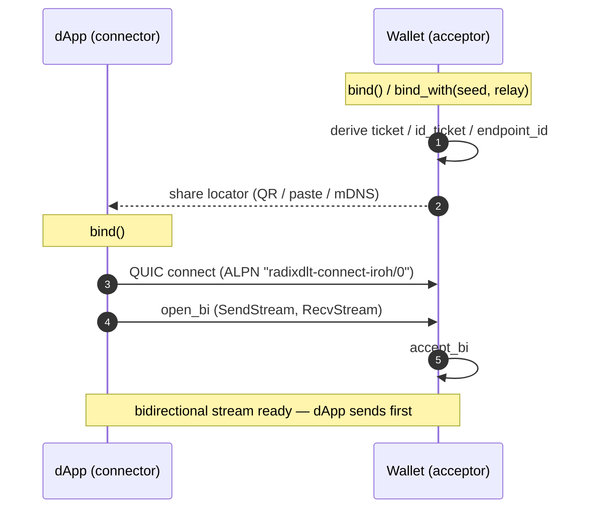
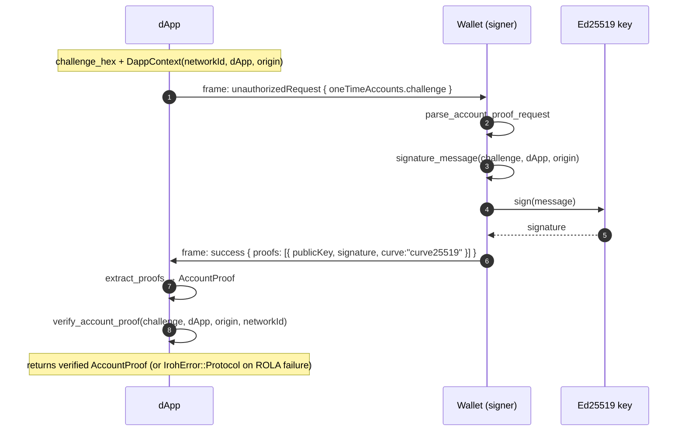
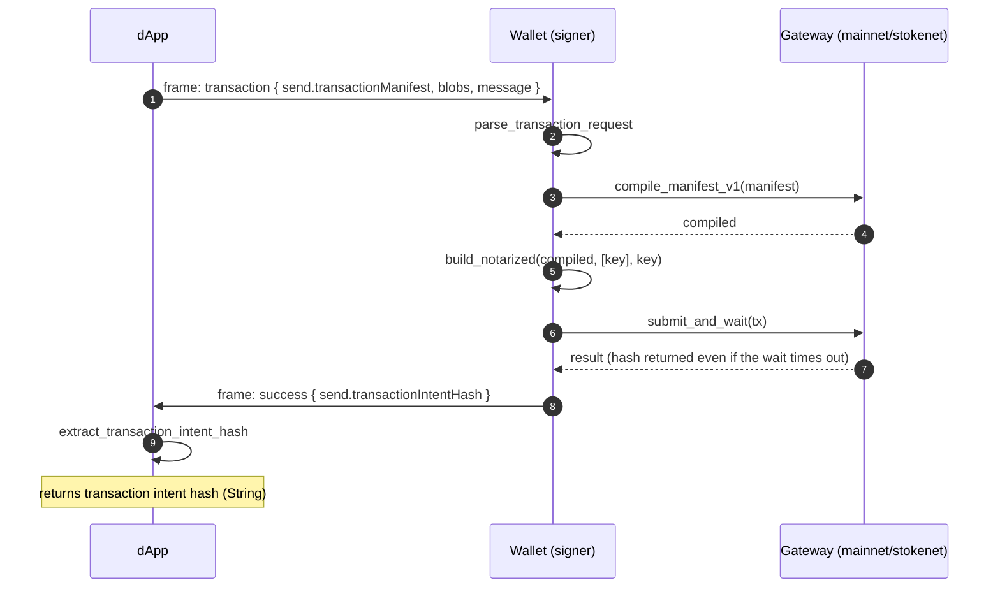
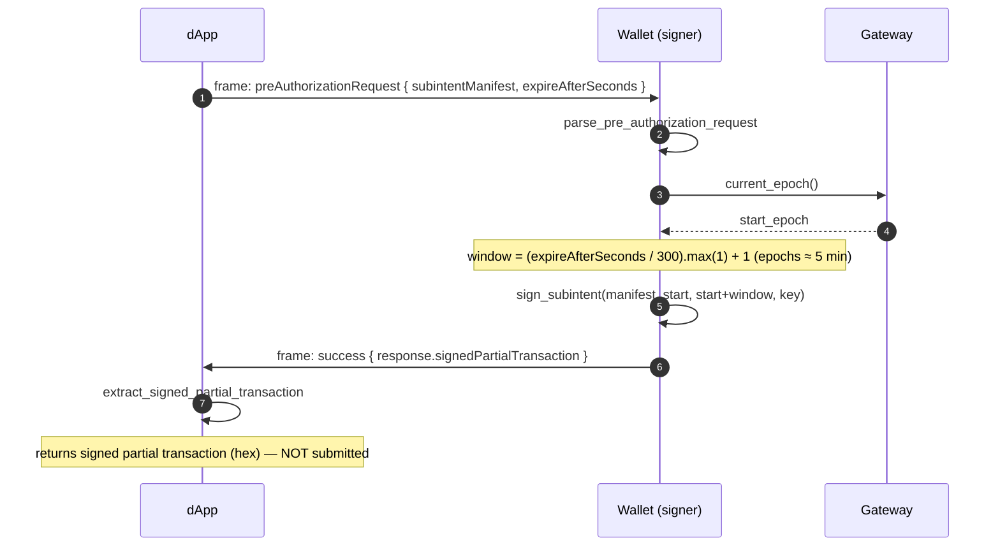
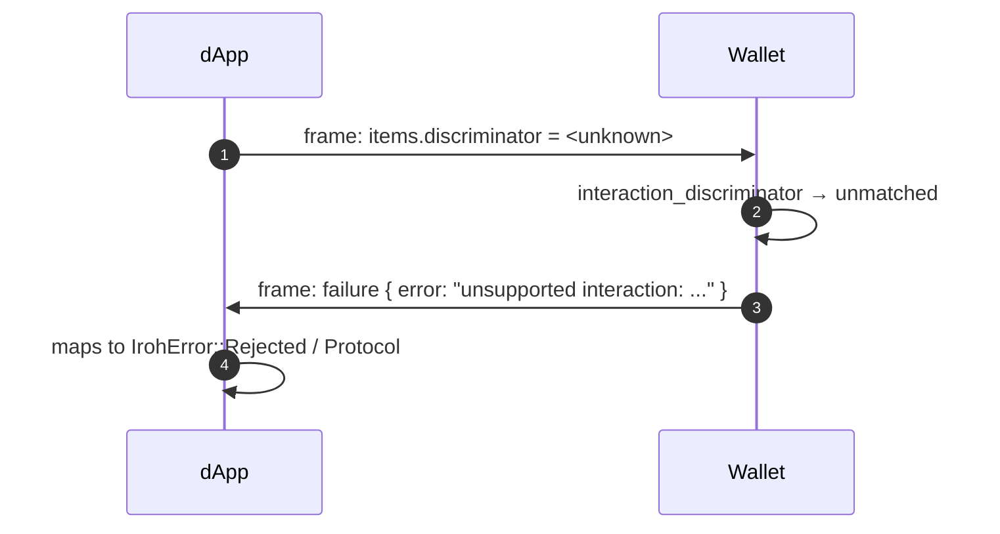

# radixdlt-connect-iroh — Transport Protocol Specification

***English** · [Español](PROTOCOL.es.md)*

Version: `radixdlt-connect-iroh/0` · Status: reflects the code in
`crates/connect-iroh` (`src/lib.rs`, `src/protocol.rs`) and the shared
wallet-interaction schema in `crates/connect-types`.

This document specifies how two pure-Rust SDK peers exchange Radix
wallet-interaction messages over the [iroh](https://iroh.computer) (QUIC)
transport. It is an alternative to the WebRTC transport of `radixdlt-connect`;
it does **not** interoperate with the Radix mobile wallet (which speaks Radix
Connect only over WebRTC). Both endpoints run the SDK — e.g. a desktop signer, a
server, or a device — so flows such as ROLA "log in with Radix" run entirely in
Rust with no phone involved.

---

## 1. Roles

| Role | API | Behaviour |
| --- | --- | --- |
| **dApp** | `IrohConnector::connect*` + `protocol::request_*` | Initiates the QUIC connection, opens the stream, **sends the request first**, then reads and (for ROLA) natively verifies the response. |
| **Wallet** (signer) | `IrohConnector::accept` + `protocol::Wallet::answer` | Accepts the connection, **receives the request first**, holds the Ed25519 key, and answers the interaction. |

Both roles are symmetric at the transport level (`IrohChannel` can send and
receive in either direction); the "who sends first" rule below is what
distinguishes them.

---

## 2. Transport layer

- **Substrate:** iroh 1.x endpoints over QUIC.
- **ALPN:** `radixdlt-connect-iroh/0` (`ALPN` constant, `src/lib.rs`). A peer
  that negotiates any other ALPN is not a participant in this protocol.
- **Stream:** exactly **one bidirectional QUIC stream** per interaction. The
  connecting side calls `open_bi`; the accepting side calls `accept_bi`.
- **Directionality rule:** the **connecting** side (dApp) writes the first
  message; the **accepting** side (Wallet) reads first. This ordering is the
  contract that keeps request/response aligned — there is no explicit
  handshake message.

### 2.1 Framing

Every message is a single JSON document (`serde_json::Value`) written to the
stream as a **length-prefixed frame**:

```
┌────────────────────┬──────────────────────────────┐
│ length (u32, BE)   │ JSON body (`length` bytes)    │
│ 4 bytes            │ UTF-8, serde_json              │
└────────────────────┴──────────────────────────────┘
```

- `length` is the byte count of the JSON body, big-endian `u32`.
- The reader does `read_exact(4)` then `read_exact(length)` (`recv_message`).
- No maximum size is enforced at the protocol layer beyond `u32` range; QUIC
  flow control applies.

### 2.2 Connection lifecycle

1. dApp resolves the Wallet's address (see §3) and `connect`s with the ALPN.
2. dApp `open_bi` → gets `(SendStream, RecvStream)`; Wallet `accept_bi`.
3. Messages are exchanged per the interaction flow (§5).
4. The sender of the last message calls `finish()` on its send stream so the
   data is flushed; the peer calls `close()` (QUIC close code `0`, reason
   `"done"`). `wait_closed()` blocks until the connection is torn down, which
   guarantees delivery of the final frame before the endpoint is dropped.

---

## 3. Pairing & discovery

An iroh endpoint is identified by its `EndpointId` (its public key). A peer
needs the Wallet's `EndpointId` and, unless discovery/relay resolves it, at
least one transport address. The crate offers three locators:

| Locator | Produced by | Contents | Use |
| --- | --- | --- | --- |
| **ticket** | `ticket()` | hex(JSON of `EndpointAddr` = id + local socket addrs, wildcard IPs mapped to loopback) | Same-host / LAN pairing (paste or QR). Consumed by `connect_to_ticket`. |
| **id_ticket** | `id_ticket()` | hex(JSON of `EndpointAddr` = id **only**, no addrs) | Internet hubs with a persistent identity; peer resolves addrs via discovery. Consumed by `connect_to_ticket`. |
| **endpoint id** | `endpoint_id_string()` / `endpoint_id_from_seed(seed)` | the `EndpointId` string | mDNS / discovery pairing. Consumed by `connect_to_endpoint_id`. |

`endpoint_id_from_seed(&seed)` derives the `EndpointId` **offline** (no endpoint
bound), so a hub locator can be printed/distributed ahead of time; binding the
same 32-byte seed later yields the same id.

### 3.1 Identity

- **Ephemeral** (`bind()` / `bind_with(None, …)`): a fresh random key each run.
- **Fixed** (`bind_with(Some(seed), …)`): a 32-byte seed → a stable
  `EndpointId` and stable `id_ticket` across restarts. The same 32 bytes used as
  a Radix account key unify channel and ledger identity.

### 3.2 Relay / reachability

| Mode | Meaning |
| --- | --- |
| `Relay::Disabled` | Direct connections only (same host / LAN); no relay, no discovery. Preset `Minimal`, `RelayMode::Disabled`. |
| `Relay::Enabled` | n0 public relays + discovery; peers behind NAT are reachable over the internet by `EndpointId` alone. Preset `N0`. |

---

## 4. Message format (application layer)

The JSON payloads are the **same wallet-interaction schema** the WebRTC
transport uses, built by `radixdlt-connect-types`. Requests and responses are
discriminated envelopes.

### 4.1 Request envelope

```json
{
  "interactionId": "<uuid-v4>",
  "metadata": {
    "version": 2,
    "networkId": <u8>,
    "dAppDefinitionAddress": "<account_...>",
    "origin": "<origin string>"
  },
  "items": { "discriminator": "<kind>", ... }
}
```

The **request kind** is `items.discriminator`, read by
`interaction_discriminator`:

| `items.discriminator` | Interaction |
| --- | --- |
| `unauthorizedRequest` / `authorizedRequest` | Account proof (ROLA) / account share |
| `transaction` | Sign + submit a transaction manifest |
| `preAuthorizationRequest` | Sign a subintent (pre-authorization) |

### 4.2 Response envelope

```json
{ "discriminator": "success" | "failure", "interactionId": "<echoed>", "items": { ... } }
```

- **`failure`** carries a top-level `"error"` string (no `items`). On the dApp
  side it maps to `IrohError::Rejected` / `Protocol`.
- **`success`** carries `items` shaped per the interaction (proofs, intent hash,
  or signed partial transaction).

The Wallet always echoes the request's `interactionId` in its response.

---

## 5. Interaction flows

### 5.1 Connection establishment



### 5.2 Account proof — ROLA "log in with Radix"

`request_account_proof` → `Wallet::answer` → `account_proof_response`.



Key point: the ROLA proof is **verified natively on the dApp side**
(`radixdlt-rola::verify_account_proof`) before `request_account_proof` returns.

### 5.3 Transaction — sign and submit

`request_transaction` → `Wallet::answer` → `transaction_response`.



Note: the Wallet returns the transaction intent hash on submit **even if the
subsequent wait fails** (e.g. timeout) — the tx was already broadcast.

### 5.4 Pre-authorization — sign a subintent (no submit)

`request_pre_authorization` → `Wallet::answer` → `pre_authorization_response`.



### 5.5 Unsupported / malformed request



---

## 6. Error model

`IrohError` (localized to the system language on `Display`):

| Variant | Raised when |
| --- | --- |
| `Bind` | Local endpoint could not bind. |
| `Connect` | Could not reach / dial the peer, or an invalid ticket/endpoint id. |
| `Accept` | Error accepting an incoming connection (or endpoint closed). |
| `Stream` | QUIC stream read/write error (including framing I/O). |
| `Protocol` | Message could not be (de)serialized, or an interaction-level error (e.g. ROLA verification failed, malformed response). |
| `Rejected` | The Wallet returned a `failure` response (`WalletInteractionError::WalletRejected`). |

---

## 7. Security notes

- **Channel confidentiality/integrity:** provided by QUIC/TLS; each endpoint is
  keyed by its `EndpointId`, so connecting to a known id authenticates the peer
  at the transport layer.
- **ROLA:** account ownership is proven and **verified natively** by the dApp
  against the challenge, dApp definition, origin and network id — independently
  of transport-layer authentication.
- **Identity reuse:** using a Radix account's 32-byte key as the endpoint seed
  ties channel identity to ledger identity; treat the seed as key material.
- **Relay trust:** `Relay::Enabled` routes setup through n0 relays; relays see
  connection metadata but not the QUIC-encrypted stream contents.
