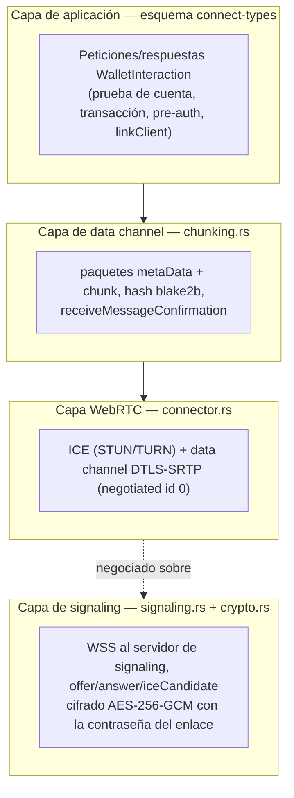
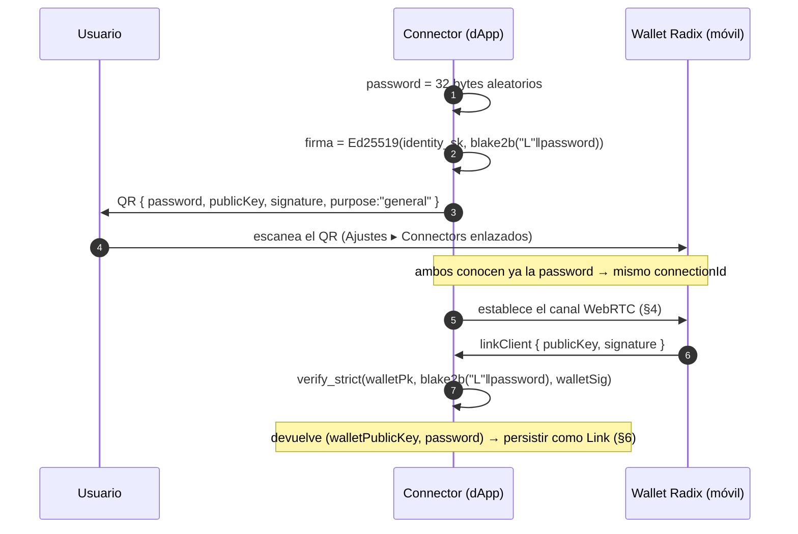
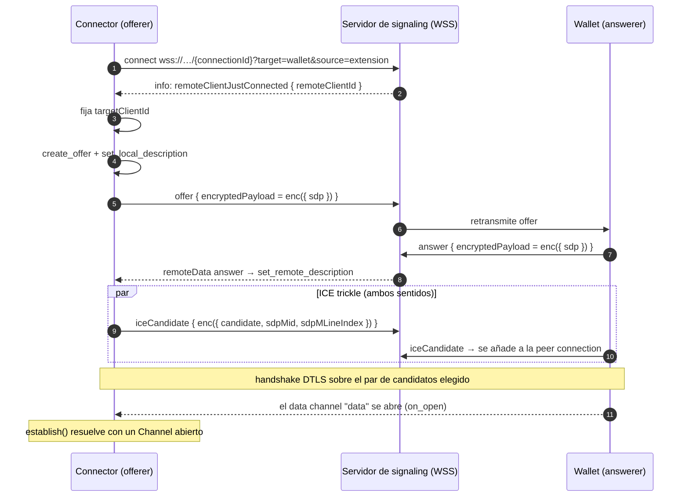
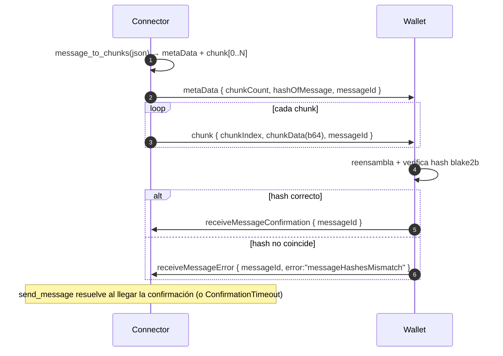
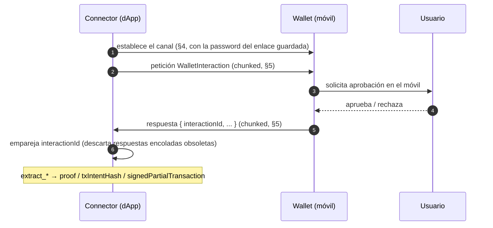

# radixdlt-connect — Especificación del protocolo Radix Connect (WebRTC)

*[English](PROTOCOL.md) · **Español***

Estado: refleja el código de `crates/connect` (`src/lib.rs`, `signaling.rs`,
`connector.rs`, `crypto.rs`, `chunking.rs`, `state.rs`). Este crate es una
reimplementación nativa en Rust del connector de Radix Connect
(`@radixdlt/radix-connect-webrtc`); habla con la **wallet móvil real de Radix**.
Para peers Rust del SDK usa en su lugar el transporte Iroh
([`radixdlt-connect-iroh`](../../connect-iroh/docs/PROTOCOL.es.md)); ambos
transportan el mismo [esquema de interacción](../../connect-types/docs/SCHEMA.es.md).

---

## 1. Visión general

Conectar una dApp/escritorio con una wallet móvil Radix implica **tres capas**:

La **contraseña del enlace** (un secreto compartido de 32 bytes establecido en
el emparejamiento) es la raíz de confianza: deriva el id del canal de signaling
y cifra cada carga de signaling, de modo que solo la wallet emparejada puede
completar la negociación WebRTC.

Nosotros somos siempre el **iniciador/offerer**; la wallet es la **answerer**.

---

## 2. Criptografía (`crypto.rs`)

Todos los valores tienen paridad con `radix-connect-webrtc`.

| Valor | Definición |
| --- | --- |
| `connectionId` | `hex( blake2b_256(password) )` — el id de la sala de signaling. |
| `encryptionKey` | los 32 bytes de `password` en crudo (se usan directamente como clave AES-256-GCM). |
| carga cifrada | `hex( IV(12 bytes) ‖ AES-256-GCM(key, IV, texto) )` (el ciphertext incluye el tag de 16 bytes). AAD vacío. |
| `linkingMessage` | `blake2b_256( "L" ‖ password )` — firmado por ambas identidades al emparejar. |

El IV son 12 bytes aleatorios nuevos por cifrado. El descifrado exige al menos
`12 + 16` bytes (IV + tag GCM).

---

## 3. Emparejamiento (`Connector::pair`)

Antes de cualquier interacción, connector y wallet deben compartir una
contraseña de enlace. El connector la genera, la muestra en un QR, y ambos lados
firman un mensaje de enlace para autenticarse mutuamente.

El connector verifica la firma de enlace de la wallet con `verify_strict`; una
firma inválida aborta el emparejamiento. El `purpose` del QR es `"general"`.

---

## 4. Establecimiento del canal (`connector::establish`)

`establish` abre el WebSocket de signaling, crea la peer connection y un **data
channel negociado (id 0, ordenado)** —igual que la extensión de navegador— y
conduce ICE hasta que el canal se abre o expira `open_timeout`.

Detalles fundamentados en el código:

- Los candidatos que llegan **antes** de fijar la descripción remota se
  encolan (`pending_remote_candidates`) y se vuelcan al aplicar el answer.
- Como somos el offerer, una señal `Offer`/`Confirmation` entrante se ignora.
- El conjunto ICE por defecto es Google STUN + el relay TURN público de Radix
  (`radix_default_ice_servers`); se sobrescribe con `Connector::with_ice_servers`.
- Si la wallet no aparece, el bucle devuelve `ConnectError::ChannelTimeout` al
  vencer el plazo.

---

## 5. Mensajería de aplicación sobre el data channel (`chunking.rs`)

Los frames del data channel son `Package`s JSON de texto, discriminados por
`packageType`:

| `packageType` | Campos | Rol |
| --- | --- | --- |
| `metaData` | `chunkCount`, `messageByteCount`, `hashOfMessage` (hex blake2b_256), `messageId` | Anuncia un mensaje entrante. |
| `chunk` | `chunkIndex`, `chunkData` (base64), `messageId` | Una porción de la carga. |
| `receiveMessageConfirmation` | `messageId` | El receptor confirmó un mensaje válido. |
| `receiveMessageError` | `messageId`, `error` | El receptor lo rechazó (p. ej. hash no coincide). |

Un mensaje de aplicación (un JSON `WalletInteraction`) se parte en porciones de
`CHUNK_SIZE = 11 500` bytes: un paquete `metaData` seguido de N `chunk`. El
receptor reensambla, comprueba el hash blake2b y responde con un
`receiveMessageConfirmation` (o `receiveMessageError` si no coincide).

`send_message` espera una confirmación cuyo `messageId` coincida; un
`ERROR:<id>` se mapea a error de protocolo, y si no llega respuesta en
`confirm_timeout` da `ConfirmationTimeout`.

---

## 6. Interacción de extremo a extremo (API de alto nivel)

Los métodos `Connector::request_*` ejecutan toda la pila para una interacción:
establecer → enviar petición → esperar la respuesta con el **`interactionId`
coincidente**.

Por qué el emparejamiento exacto de id: la `dAppRequestQueue` de la wallet puede
retener peticiones obsoletas de intentos anteriores cuyas respuestas llegan
antes; `send_and_await_response` descarta todo hasta que el id coincide, para
que una aprobación lenta del usuario no se confunda con la respuesta de otro.

Interacciones soportadas (esquema en
[SCHEMA.es.md](../../connect-types/docs/SCHEMA.es.md)):

| Método | Interacción | Devuelve |
| --- | --- | --- |
| `request_account_proof` | prueba de cuenta ROLA (+ nombre de persona opcional) | respuesta cruda (`proofs`) |
| `request_accounts` | compartir cuenta, sin prueba | respuesta cruda (`accounts`) |
| `request_transaction` | firmar + enviar un manifiesto | `transactionIntentHash` |
| `request_pre_authorization` | firmar un subintent (sin enviar) | `signedPartialTransaction` (hex) |

---

## 7. Estado persistente del enlace (`state.rs`, `connector.json`)

Los emparejamientos se guardan en un `connector.json` compatible con el
connector JS de Radix Connect, para reutilizar un emparejamiento existente sin
volver a emparejar.

- `identity` — el par de claves Ed25519 persistente del connector (`privateKey`
  / `publicKey`, hex).
- `links[]` — un `Link` por dispositivo emparejado: `password` (hex, 32 bytes →
  su propio `connectionId`), `walletPublicKey`, `linkedAt`, `label` opcional.
- Un campo legacy `link` único se migra a `links` al cargar; al guardar solo se
  escribe `links`.
- Al guardar, el archivo se escribe `0600` (solo propietario) en Unix.

Cada link lleva su propia password (y por tanto su propio `connectionId`), de
modo que quien llama puede dirigir una petición a un dispositivo concreto con
`password_bytes_for(walletPublicKey)`.

---

## 8. Modelo de errores (`ConnectError`)

`Display` se localiza al idioma del sistema. Variantes destacadas:

| Variante | Se lanza cuando |
| --- | --- |
| `Signaling` / `SignalingClosed` | Falló el connect WSS / se cerró el stream de signaling. |
| `WebRtc` | Error de peer-connection / SDP / data channel. |
| `ChannelTimeout` | El data channel no se abrió antes de `open_timeout`. |
| `Crypto` | Error de clave/IV/tag o firma (incl. firma de enlace de wallet inválida). |
| `Protocol` | Paquete malformado, chunks faltantes/ausentes, hash no coincide, JSON inválido. |
| `ConfirmationTimeout` / `ResponseTimeout` | Sin `receiveMessageConfirmation` / sin respuesta de aplicación a tiempo. |

---

## 9. Notas de seguridad

- **Secreto raíz:** la password de enlace de 32 bytes deriva la sala de signaling
  (`connectionId`) y cifra el signaling; trata `connector.json` como material
  secreto (se guarda `0600`).
- **Autenticación mutua al emparejar:** connector y wallet firman cada uno
  `blake2b("L"‖password)`; el connector verifica la firma de la wallet con
  `verify_strict` antes de persistir el enlace.
- **Cifrado de transporte:** la ruta de medios es DTLS-SRTP (WebRTC); la ruta de
  signaling es AES-256-GCM sobre WSS. El servidor de signaling solo retransmite
  ciphertext.
- **Integridad:** cada mensaje de aplicación se hashea con blake2b de extremo a
  extremo y se confirma, de modo que transferencias truncadas/corruptas se
  rechazan, no se entregan.
- **La clave privada nunca sale del móvil:** el connector solo guarda la password
  del canal; la firma ocurre en la wallet tras la aprobación del usuario.
