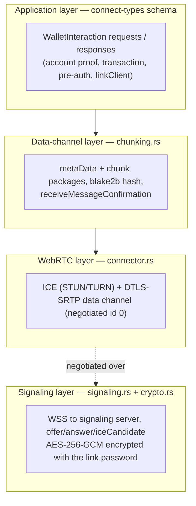
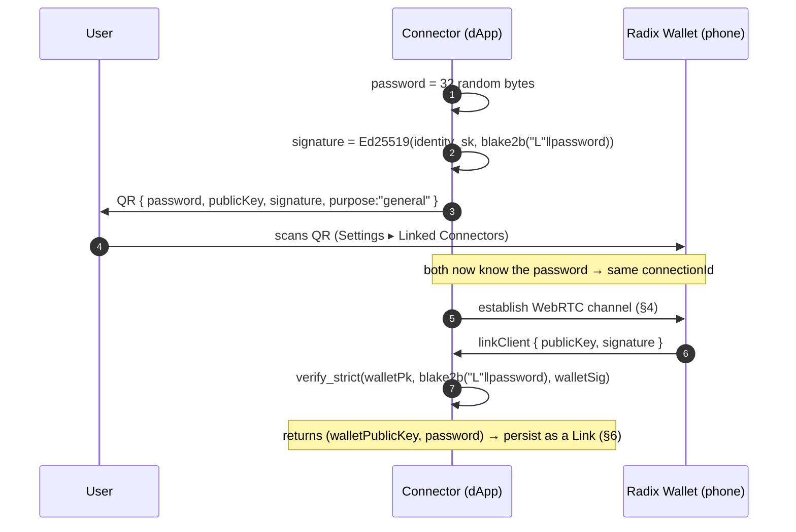
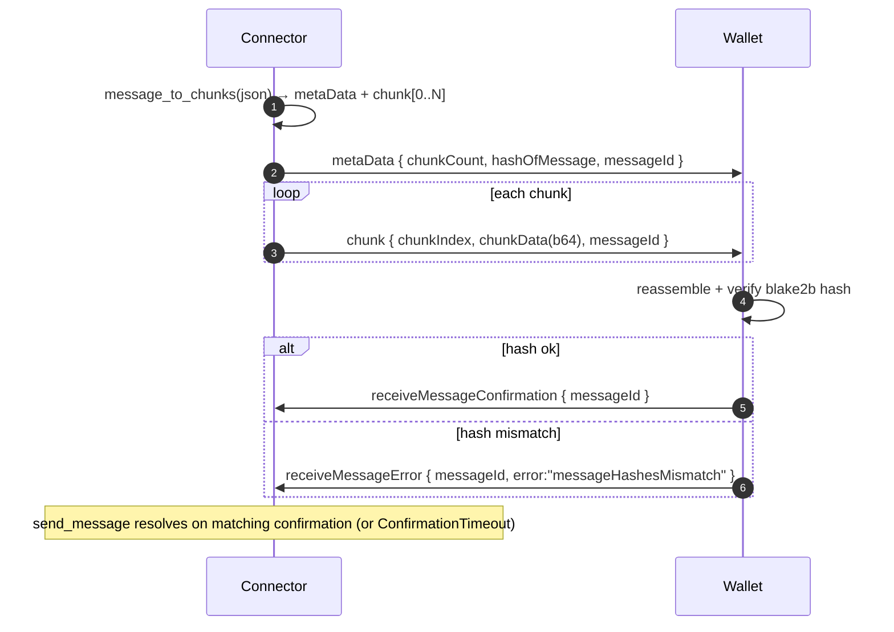
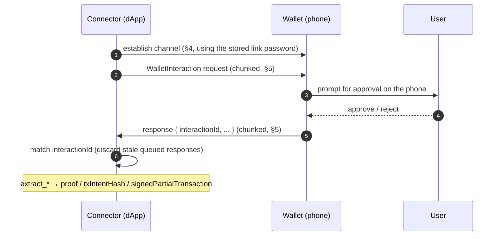

# radixdlt-connect — Radix Connect (WebRTC) Protocol Specification

***English** · [Español](PROTOCOL.es.md)*

Status: reflects the code in `crates/connect` (`src/lib.rs`, `signaling.rs`,
`connector.rs`, `crypto.rs`, `chunking.rs`, `state.rs`). This crate is a native
Rust reimplementation of the Radix Connect connector
(`@radixdlt/radix-connect-webrtc`); it talks to the **real Radix mobile wallet**.
For pure-Rust SDK-to-SDK peers use the Iroh transport instead
([`radixdlt-connect-iroh`](../../connect-iroh/docs/PROTOCOL.md)); both carry the
same [wallet-interaction schema](../../connect-types/docs/SCHEMA.md).

---

## 1. Overview

Connecting a dApp/desktop to a Radix mobile wallet involves **three layers**:

The **link password** (a shared 32-byte secret established at pairing) is the
root of trust: it derives the signaling channel id and encrypts every signaling
payload, so only the paired wallet can complete the WebRTC negotiation.

We are always the **initiator/offerer**; the wallet is the **answerer**.

---

## 2. Cryptography (`crypto.rs`)

All values are parity with `radix-connect-webrtc`.

| Value | Definition |
| --- | --- |
| `connectionId` | `hex( blake2b_256(password) )` — the signaling room id. |
| `encryptionKey` | the raw 32-byte `password` itself (used directly as the AES-256-GCM key). |
| encrypted payload | `hex( IV(12 bytes) ‖ AES-256-GCM(key, IV, plaintext) )` (ciphertext includes the 16-byte tag). AAD is empty. |
| `linkingMessage` | `blake2b_256( "L" ‖ password )` — signed by both identities at pairing. |

The IV is a fresh 12 random bytes per encryption. Decryption requires at least
`12 + 16` bytes (IV + GCM tag).

---

## 3. Pairing (`Connector::pair`)

Before any interaction the connector and wallet must share a link password. The
connector generates it, shows it in a QR, and both sides sign a linking message
to authenticate each other.

The connector verifies the wallet's linking signature with `verify_strict`; a
bad signature aborts pairing. The QR `purpose` is `"general"`.

---

## 4. Channel establishment (`connector::establish`)

`establish` opens the signaling WebSocket, creates the peer connection and a
**negotiated data channel (id 0, ordered)** — matching the browser extension —
and drives ICE until the channel opens or `open_timeout` elapses.

```mermaid
sequenceDiagram
    autonumber
    participant C as Connector (offerer)
    participant S as Signaling server (WSS)
    participant W as Wallet (answerer)

    C->>S: connect wss://…/{connectionId}?target=wallet&source=extension
    S-->>C: info: remoteClientJustConnected { remoteClientId }
    C->>C: set targetClientId
    C->>C: create_offer + set_local_description
    C->>S: offer { encryptedPayload = enc({ sdp }) }
    S->>W: relay offer
    W->>S: answer { encryptedPayload = enc({ sdp }) }
    S-->>C: remoteData answer → set_remote_description
    par ICE trickle (both directions)
        C->>S: iceCandidate { enc({ candidate, sdpMid, sdpMLineIndex }) }
        W->>S: iceCandidate → set on peer connection
    end
    Note over C,W: DTLS handshake over selected candidate pair
    W-->>C: data channel "data" opens (on_open)
    Note over C: establish() resolves with an open Channel
```

Details grounded in the code:

- Candidates that arrive **before** the remote description is set are queued
  (`pending_remote_candidates`) and flushed once the answer is applied.
- Since we are the offerer, an incoming `Offer`/`Confirmation` signal is ignored.
- The default ICE set is Google STUN + the public Radix TURN relay
  (`radix_default_ice_servers`); override with `Connector::with_ice_servers`.
- If the wallet never appears, the loop returns `ConnectError::ChannelTimeout`
  at the deadline.

---

## 5. Application messaging over the data channel (`chunking.rs`)

Data-channel frames are JSON text `Package`s discriminated by `packageType`:

| `packageType` | Fields | Role |
| --- | --- | --- |
| `metaData` | `chunkCount`, `messageByteCount`, `hashOfMessage` (hex blake2b_256), `messageId` | Announces an incoming message. |
| `chunk` | `chunkIndex`, `chunkData` (base64), `messageId` | One slice of the payload. |
| `receiveMessageConfirmation` | `messageId` | Receiver acked a valid message. |
| `receiveMessageError` | `messageId`, `error` | Receiver rejected it (e.g. hash mismatch). |

An application message (a `WalletInteraction` JSON) is split into `CHUNK_SIZE =
11 500`-byte slices: one `metaData` package followed by N `chunk` packages. The
receiver reassembles, checks the blake2b hash, then replies with a
`receiveMessageConfirmation` (or `receiveMessageError` on mismatch).

`send_message` waits for a confirmation whose `messageId` matches; an
`ERROR:<id>` maps to a protocol error, and no reply within `confirm_timeout`
gives `ConfirmationTimeout`.

---

## 6. End-to-end interaction (high-level API)

`Connector::request_*` methods run the whole stack for one interaction:
establish → send request → await the response with the **matching
`interactionId`**.

Why the exact-id match: the wallet's `dAppRequestQueue` may hold stale requests
from earlier attempts whose responses arrive first;
`send_and_await_response` discards everything until the id matches, so a slow
user approval is not mistaken for someone else's response.

Interactions supported (schema in
[SCHEMA.md](../../connect-types/docs/SCHEMA.md)):

| Method | Interaction | Returns |
| --- | --- | --- |
| `request_account_proof` | ROLA account proof (+ optional persona name) | raw response (`proofs`) |
| `request_accounts` | account share, no proof | raw response (`accounts`) |
| `request_transaction` | sign + submit a manifest | `transactionIntentHash` |
| `request_pre_authorization` | sign a subintent (no submit) | `signedPartialTransaction` (hex) |

---

## 7. Persistent link state (`state.rs`, `connector.json`)

Pairings are stored in a `connector.json` compatible with the JS Radix Connect
connector, so an existing pairing is reused without re-pairing.

- `identity` — the connector's persistent Ed25519 keypair (`privateKey` /
  `publicKey`, hex).
- `links[]` — one `Link` per paired device: `password` (hex, 32 bytes →
  its own `connectionId`), `walletPublicKey`, `linkedAt`, optional `label`.
- A legacy single `link` field is migrated into `links` on load; on save only
  `links` is written.
- On save the file is written `0600` (owner-only) on Unix.

Multiple links each carry their own password (hence their own `connectionId`),
so a caller can dispatch a request to one specific device with
`password_bytes_for(walletPublicKey)`.

---

## 8. Error model (`ConnectError`)

`Display` is localized to the system language. Notable variants:

| Variant | Raised when |
| --- | --- |
| `Signaling` / `SignalingClosed` | WSS connect failed / the signaling stream closed. |
| `WebRtc` | Peer-connection / SDP / data-channel error. |
| `ChannelTimeout` | Data channel did not open before `open_timeout`. |
| `Crypto` | Key/IV/tag or signature error (incl. invalid wallet linking signature). |
| `Protocol` | Malformed package, missing/absent chunks, hash mismatch, bad JSON. |
| `ConfirmationTimeout` / `ResponseTimeout` | No `receiveMessageConfirmation` / no application response in time. |

---

## 9. Security notes

- **Root secret:** the 32-byte link password both derives the signaling room
  (`connectionId`) and encrypts signaling; treat `connector.json` as secret
  material (it is stored `0600`).
- **Mutual authentication at pairing:** connector and wallet each sign
  `blake2b("L"‖password)`; the connector verifies the wallet's signature with
  `verify_strict` before persisting the link.
- **Transport encryption:** the media path is DTLS-SRTP (WebRTC); the signaling
  path is AES-256-GCM over WSS. The signaling server relays ciphertext only.
- **Integrity:** every application message is blake2b-hashed end to end and
  acknowledged, so truncated/corrupted transfers are rejected, not delivered.
- **The private key never leaves the phone:** the connector only ever holds the
  channel password; signing happens in the wallet after user approval.
