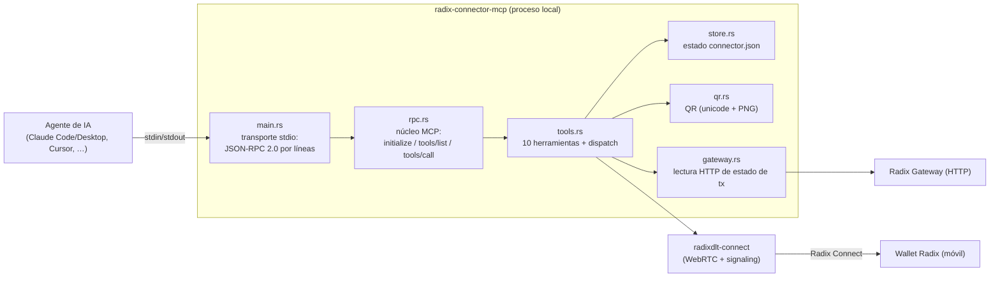
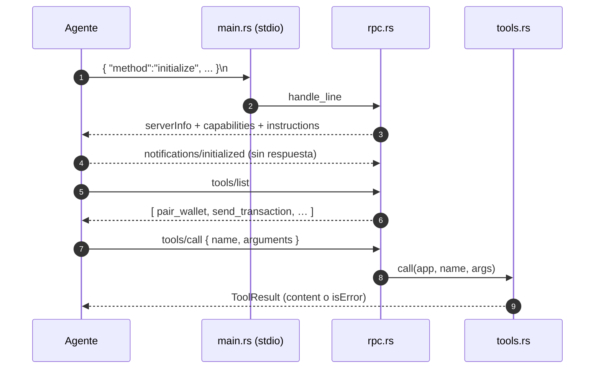
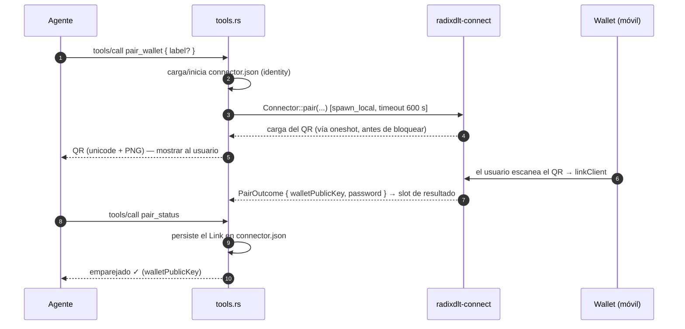
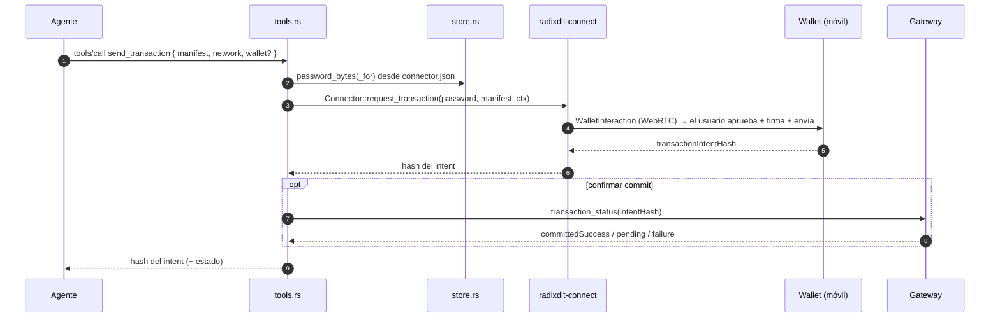

# radix-connector-mcp — Arquitectura

*[English](ARCHITECTURE.md) · **Español***

Estado: refleja el código de `crates/connector-mcp` (`main.rs`, `rpc.rs`,
`tools.rs`, `store.rs`, `qr.rs`, `gateway.rs`). Este crate es un **servidor MCP
(Model Context Protocol) local** que permite a agentes de IA (Claude
Code/Desktop, Cursor, Antigravity, …) emparejar una Wallet Radix y obtener
transacciones **firmadas en el propio móvil del usuario** — la clave privada
nunca sale del dispositivo.

---

## 1. Por qué se ejecuta en local

Firmar una transacción Radix exige mantener un canal Radix Connect (WebRTC) vivo
con el móvil durante toda la aprobación, y los secretos del enlace nunca deben
salir de la máquina del usuario. Un backend serverless sin estado no puede
sostener ese canal, así que esta pieza corre en local y habla MCP por **stdio**
con el agente que la lanzó.

---

## 2. Componentes

- **stdout** transporta solo mensajes de protocolo; todos los logs legibles van a
  **stderr**.
- Todo el servidor corre en un **runtime Tokio monohilo dentro de un `LocalSet`**
  (un canal de wallet a la vez; mantiene locales los futures WebRTC no-`Send`
  mientras un emparejamiento lento corre en segundo plano).
- El estado compartido es un `Rc<App>` con mutabilidad interior `RefCell`; los
  handlers no deben mantener un borrow a través de un `.await`.

---

## 3. Transporte y núcleo MCP

- **Framing (`main.rs`):** lee stdin línea a línea; cada línea de petición
  produce como mucho una línea de respuesta en stdout; las notificaciones no
  producen ninguna; las líneas en blanco se ignoran.
- **MCP (`rpc.rs`):** JSON-RPC 2.0. Atiende `initialize` (negocia versión de
  protocolo — la más nueva `2025-06-18`, también acepta `2025-03-26` /
  `2024-11-05`), `ping`, `tools/list`, `tools/call`. `notifications/*` no
  reciben respuesta. Los errores usan códigos JSON-RPC (`-32700` parseo,
  `-32600` petición inválida, `-32601` método no encontrado).

---

## 4. Conjunto de herramientas (`tools.rs`)

| Herramienta | Propósito |
| --- | --- |
| `pair_wallet` | Inicia el emparejamiento: devuelve un QR a escanear (ejecuta el handshake en segundo plano). |
| `pair_status` | Consulta el resultado del emparejamiento en curso. |
| `list_wallets` | Lista los dispositivos emparejados. |
| `remove_wallet` | Desempareja un dispositivo. |
| `request_accounts` | Pide a la wallet compartir dirección(es) de cuenta, sin prueba. |
| `request_account_proof` | Prueba ROLA "iniciar sesión con Radix". |
| `send_transaction` | Envía un manifiesto para que el usuario firme + envíe. |
| `deploy_package` | Publica un paquete (blobs WASM + RPD), con dry-run previo. |
| `request_pre_authorization` | Hace firmar un subintent (sin enviar). |
| `transaction_status` | Lee el estado de commit de una transacción desde el Gateway. |

El dispatch es un único `match` en `tools::call`; una herramienta desconocida
devuelve un resultado `isError` en vez de un error JSON-RPC, para que el agente
vea un fallo de herramienta.

---

## 5. Flujos clave

### 5.1 Emparejamiento (asíncrono, por sondeo)

`pair_wallet` devuelve el QR **inmediatamente** y ejecuta el handshake Radix
Connect (que bloquea hasta el escaneo) en una tarea de fondo `spawn_local`;
`pair_status` lee el slot de resultado compartido.

### 5.2 Firma de una transacción

`deploy_package` tiene la misma forma con un **dry-run previo al despliegue** y
blobs adjuntos; `request_pre_authorization` devuelve un
`signedPartialTransaction` y **no** envía.

---

## 6. Estado y configuración (`store.rs`)

El estado vive en un `connector.json` bajo el directorio de config del SO,
respetando `RADIX_CONNECTOR_HOME`:

- Linux: `~/.config/radix-connector/connector.json`
- macOS: `~/Library/Application Support/radix-connector/connector.json`
- Windows: `%APPDATA%\radix-connector\connector.json`

Reutiliza `LinkState` de [`radixdlt-connect`](../../connect/docs/PROTOCOL.es.md#7-estado-persistente-del-enlace-staters-connectorjson):
una identidad persistente del connector más un `Link` (password +
`walletPublicKey`) por dispositivo emparejado. `load_or_init` crea una identidad
nueva en el primer arranque.

---

## 7. Notas de seguridad

- **Higiene de stdout:** solo JSON de protocolo en stdout; logs en stderr — un
  print perdido corrompería el stream MCP.
- **Custodia de secretos:** el servidor solo guarda passwords de canal
  (`connector.json`, en `0600`); la clave de firma se queda en el móvil y el
  usuario aprueba cada firma ahí.
- **Red explícita:** cada herramienta de firma exige `mainnet` / `stokenet`
  explícito, para que un manifiesto no se firme contra la red equivocada por
  defecto.
- **Solo local:** la comunicación es stdio con el agente que lo lanza; no hay
  ningún listener de red.
