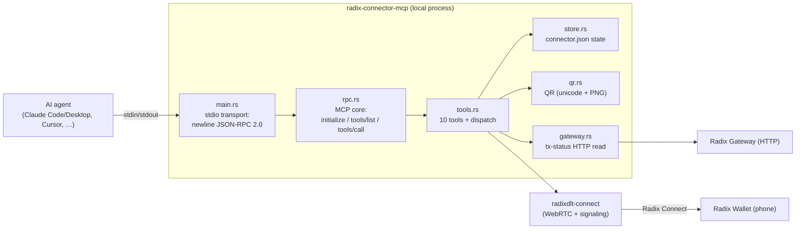
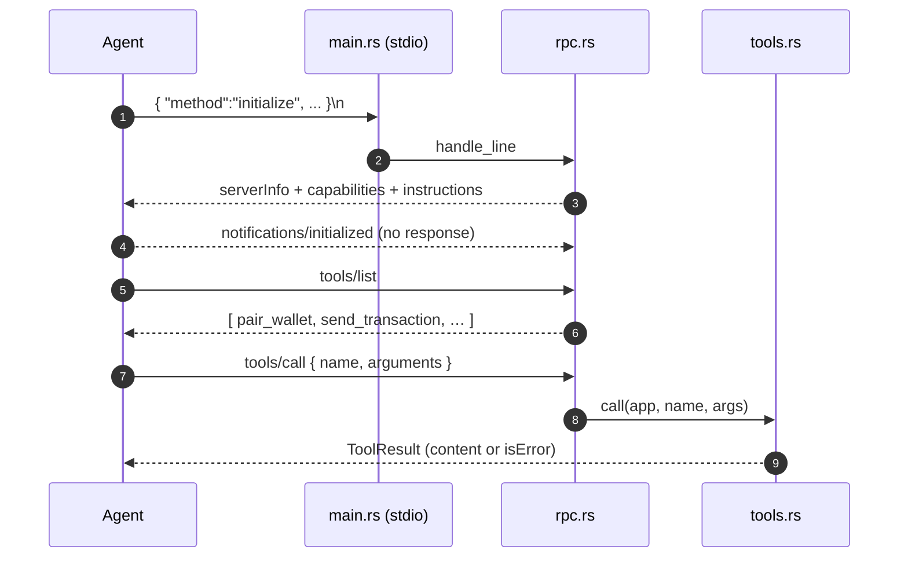
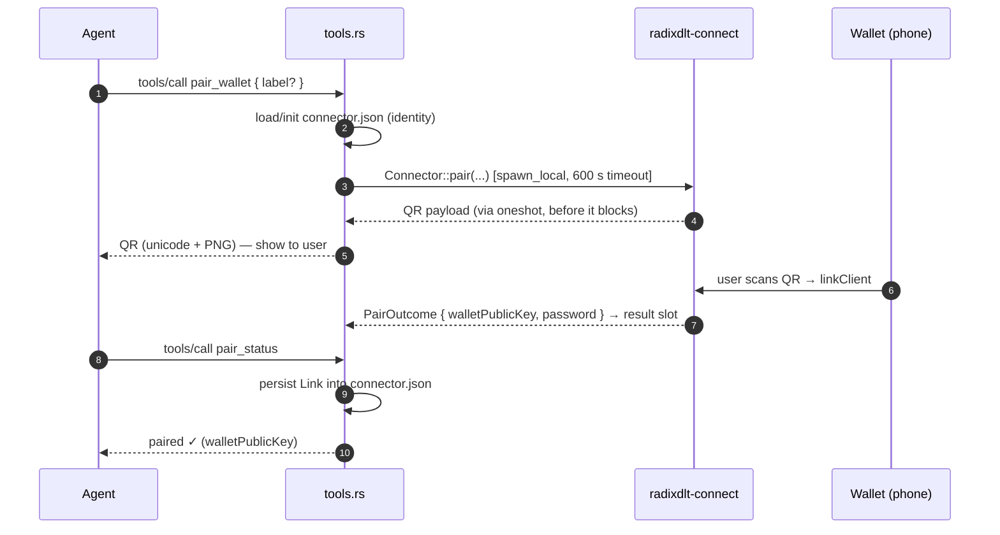
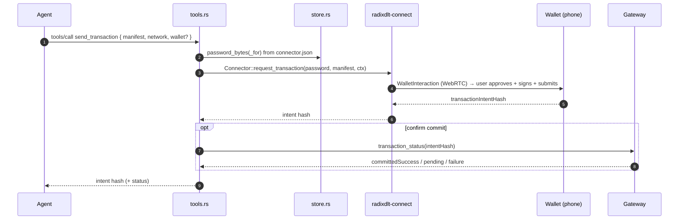

# radix-connector-mcp — Architecture

***English** · [Español](ARCHITECTURE.es.md)*

Status: reflects the code in `crates/connector-mcp` (`main.rs`, `rpc.rs`,
`tools.rs`, `store.rs`, `qr.rs`, `gateway.rs`). This crate is a **local MCP
(Model Context Protocol) server** that lets AI agents (Claude Code/Desktop,
Cursor, Antigravity, …) pair a Radix Wallet and get transactions **signed on the
user's own phone** — the private key never leaves the device.

---

## 1. Why it runs locally

Signing a Radix transaction requires holding a live Radix Connect (WebRTC)
channel to the phone for the whole approval, and the link secrets must never
leave the user's machine. A stateless serverless backend cannot hold that
channel, so this piece runs locally and speaks MCP over **stdio** to the agent
that launched it.

---

## 2. Components

- **stdout** carries protocol messages only; all human-readable logs go to
  **stderr**.
- The whole server runs on a **single-threaded Tokio runtime inside a
  `LocalSet`** (one wallet channel at a time; keeps the non-`Send` WebRTC futures
  local while a slow pairing runs in the background).
- Shared state is an `Rc<App>` with `RefCell` interior mutability; handlers must
  not hold a borrow across an `.await`.

---

## 3. Transport & MCP core

- **Framing (`main.rs`):** read stdin line by line; each request line yields at
  most one response line on stdout; notifications yield none; blank lines are
  skipped.
- **MCP (`rpc.rs`):** JSON-RPC 2.0. Handles `initialize` (negotiates a protocol
  version — newest `2025-06-18`, also accepts `2025-03-26` / `2024-11-05`),
  `ping`, `tools/list`, `tools/call`. `notifications/*` get no response. Errors
  use JSON-RPC codes (`-32700` parse, `-32600` invalid request, `-32601` method
  not found).

---

## 4. Tool set (`tools.rs`)

| Tool | Purpose |
| --- | --- |
| `pair_wallet` | Start pairing: return a QR to scan (runs the handshake in the background). |
| `pair_status` | Poll the outcome of the in-flight pairing. |
| `list_wallets` | List paired devices. |
| `remove_wallet` | Unpair a device. |
| `request_accounts` | Ask the wallet to share account address(es), no proof. |
| `request_account_proof` | ROLA "log in with Radix" proof. |
| `send_transaction` | Send a manifest for the user to sign + submit. |
| `deploy_package` | Publish a package (WASM + RPD blobs), with a pre-deploy dry-run. |
| `request_pre_authorization` | Have a subintent signed (no submit). |
| `transaction_status` | Read a transaction's commit status from the Gateway. |

Dispatch is a single `match` in `tools::call`; an unknown tool returns an
`isError` result rather than a JSON-RPC error, so the agent sees a tool failure.

---

## 5. Key flows

### 5.1 Pairing (async, poll-based)

`pair_wallet` returns the QR **immediately** and runs the blocking-until-scanned
Radix Connect handshake in a background `spawn_local` task; `pair_status` reads
the shared result slot.

### 5.2 Signing a transaction

`deploy_package` is the same shape with a **pre-deploy dry-run** first and blobs
attached; `request_pre_authorization` returns a `signedPartialTransaction` and
does **not** submit.

---

## 6. State & config (`store.rs`)

State lives in a `connector.json` under the OS config dir, honouring
`RADIX_CONNECTOR_HOME`:

- Linux: `~/.config/radix-connector/connector.json`
- macOS: `~/Library/Application Support/radix-connector/connector.json`
- Windows: `%APPDATA%\radix-connector\connector.json`

It reuses `LinkState` from [`radixdlt-connect`](../../connect/docs/PROTOCOL.md#7-persistent-link-state-staters-connectorjson):
a persistent connector identity plus one `Link` (password + `walletPublicKey`)
per paired device. `load_or_init` creates a fresh identity on first run.

---

## 7. Security notes

- **stdout hygiene:** only protocol JSON on stdout; logs on stderr — a stray
  print would corrupt the MCP stream.
- **Secret custody:** the server holds only channel passwords
  (`connector.json`, stored `0600`); the signing key stays on the phone and the
  user approves every signature there.
- **Explicit network:** every signing tool requires an explicit `mainnet` /
  `stokenet`, so a manifest can't be signed against the wrong network by default.
- **Local-only:** communication is stdio to the launching agent; there is no
  network listener.
