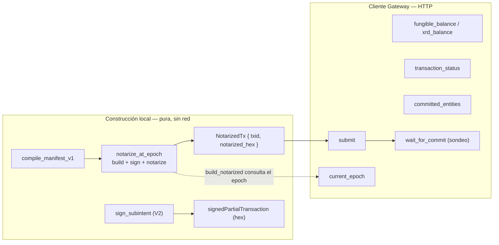
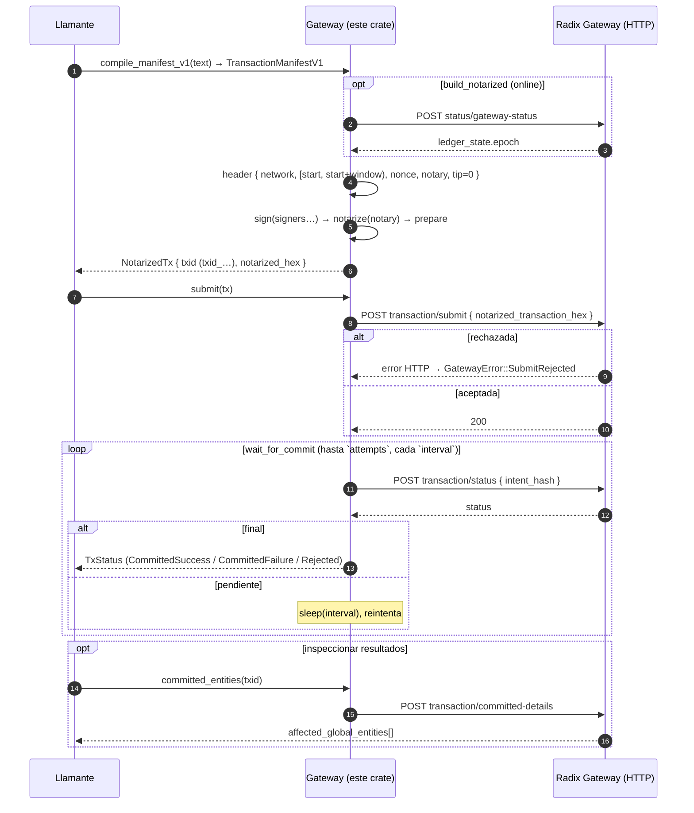
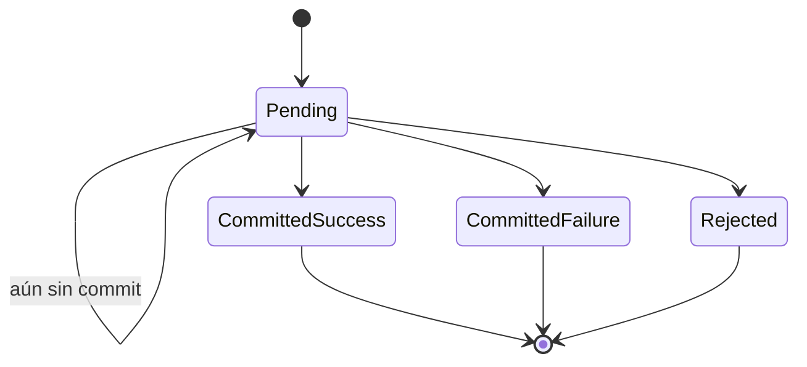

# radixdlt-gateway-tx — Ciclo de vida de la transacción y API del Gateway

*[English](LIFECYCLE.md) · **Español***

Estado: refleja `crates/gateway-tx/src/lib.rs`. Este crate hace dos cosas en Rust
nativo (sin Node, sin RET-vía-JS): **construcción local de transacciones**
(compilar → firmar → notarizar) y un **cliente HTTP del Gateway** (lecturas +
envío + sondeo de estado). Es una biblioteca pura — sin E/S de archivos, sin
imprimir, sin salir del proceso.

---

## 1. Dos mitades

`notarize_at_epoch` y `sign_subintent` son **totalmente offline**
(deterministas salvo por un nonce aleatorio). `build_notarized` es el único
builder que toca la red — consulta primero el epoch actual.

---

## 2. Ciclo de vida completo (build → submit → commit)

- `submit_and_wait` = `submit` y luego `wait_for_commit` con **40 intentos, cada
  2 s** (~80 s en el peor caso).
- La ventana de validez por defecto en `build_notarized` es de **10 epochs**;
  `notarize_at_epoch` recibe un `epoch_window` explícito.
- `tip_percentage` es `0`; el `nonce` (y el `intent_discriminator` del subintent)
  son aleatorios, así que re-notarizar el mismo manifiesto da un `txid` distinto.

---

## 3. Máquina de estados de `TxStatus`

`transaction_status` mapea la cadena `status` del Gateway; cualquier valor no
reconocido se trata como `Pending` (no final, seguir sondeando).

| `TxStatus` | Cadena del Gateway | `is_final()` | `is_success()` |
| --- | --- | --- | --- |
| `Pending` | cualquier otra | false | false |
| `CommittedSuccess` | `CommittedSuccess` | true | true |
| `CommittedFailure` | `CommittedFailure` | true | false |
| `Rejected` | `Rejected` | true | false |

`wait_for_commit` retorna en cuanto `is_final()` es true, o
`GatewayError::Timeout` si se agotan los intentos.

---

## 4. Subintents (pre-autorización V2)

`sign_subintent` construye y firma una **transacción parcial** — un subintent que
el llamante (u otra parte) puede combinar más tarde en una transacción completa.
Es offline y **no** envía.

- Compila un `SubintentManifestV2` para la red vinculada.
- Cabecera: `IntentHeaderV2` con `[start_epoch, end_epoch)`, sin límites de
  timestamp de proposer, un `intent_discriminator` aleatorio.
- Firma con `signer` y devuelve la transacción parcial firmada en **hex**.

Esto es lo que respalda la interacción de pre-autorización en el
[esquema de interacción](../../connect-types/docs/SCHEMA.es.md#5-pre-autorización--firmar-un-subintent-pre_authorization_request--pre_authorization_response).

---

## 5. Endpoints HTTP del Gateway usados

Todos son `POST` bajo la URL base de la red (`MAINNET_GATEWAY` /
`STOKENET_GATEWAY`, o una propia vía `Gateway::new`).

| Método | Endpoint | Petición → lectura |
| --- | --- | --- |
| `current_epoch` | `status/gateway-status` | `{}` → `ledger_state.epoch` |
| `fungible_balance` | `state/entity/page/fungibles/` | `{ address }` → `items[].amount` coincidente |
| `transaction_status` | `transaction/status` | `{ intent_hash }` → `status` |
| `committed_entities` | `transaction/committed-details` | `{ intent_hash, opt_ins.affected_global_entities:true }` → `transaction.affected_global_entities[]` |
| `submit` | `transaction/submit` | `{ notarized_transaction_hex }` |

Una respuesta no-2xx se convierte en `GatewayError::BadResponse` (o
`SubmitRejected` para `submit`).

---

## 6. Modelo de errores (`GatewayError`)

`Display` se localiza al idioma del sistema.

| Variante | Se lanza cuando |
| --- | --- |
| `Http(e)` | Error de red/transporte al alcanzar el Gateway. |
| `BadResponse(e)` | No-2xx o cuerpo no parseable (p. ej. falta un campo esperado). |
| `ManifestCompile(e)` | Un manifiesto (v1 o subintent v2) no compiló. |
| `Encode(e)` | Falló la preparación/codificación de la transacción. |
| `SubmitRejected(e)` | El Gateway rechazó `submit`. |
| `Timeout` | `wait_for_commit` agotó sus intentos. |

---

## 7. Notas

- **Seguridad offline:** `notarize_at_epoch` / `sign_subintent` nunca tocan la
  red, así que la firma puede ocurrir en una máquina aislada; solo
  `current_epoch`, `submit` y las llamadas de estado/lectura requieren
  conectividad.
- **Entrada de claves:** los firmantes y el notario son `Ed25519PrivateKey`
  (reexportado), así que quien llama no necesita una dependencia directa de
  `radix-common` — `Ed25519PrivateKey::from_bytes(&secret_32)`.
- **Idempotencia:** como el `nonce` es aleatorio, el mismo manifiesto firmado dos
  veces produce dos `txid` distintos (dos transacciones independientes).
