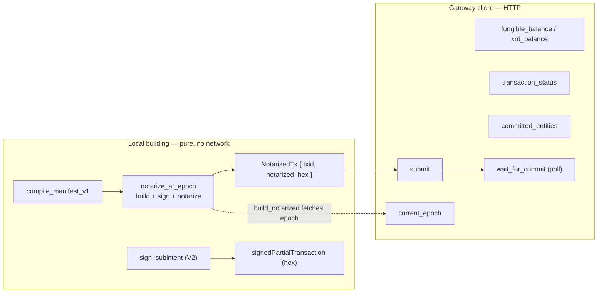
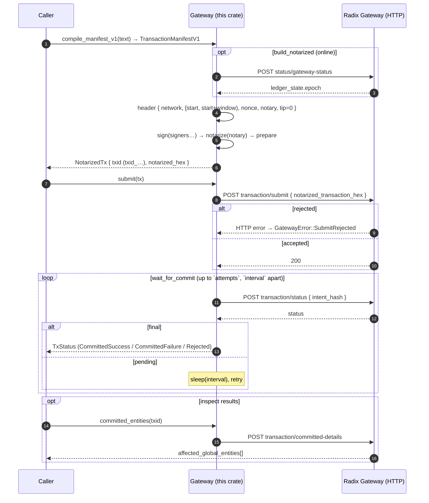
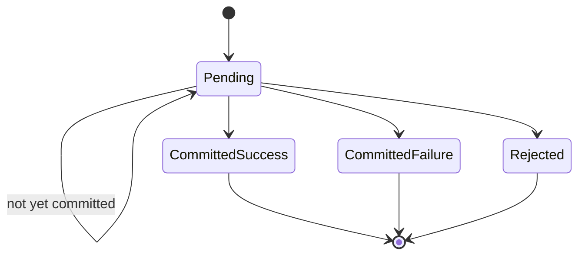

# radixdlt-gateway-tx — Transaction Lifecycle & Gateway API

***English** · [Español](LIFECYCLE.es.md)*

Status: reflects `crates/gateway-tx/src/lib.rs`. This crate does two things in
native Rust (no Node, no RET-via-JS): **local transaction building** (compile →
sign → notarize) and a **Gateway HTTP client** (reads + submit + status
polling). It is a pure library — no file I/O, no printing, no process exit.

---

## 1. Two halves

`notarize_at_epoch` and `sign_subintent` are **fully offline** (deterministic
except for a random nonce). `build_notarized` is the only builder that touches
the network — it fetches the current epoch first.

---

## 2. Full transaction lifecycle (build → submit → commit)

- `submit_and_wait` = `submit` then `wait_for_commit` with **40 attempts, 2 s
  apart** (~80 s worst case).
- Default validity window in `build_notarized` is **10 epochs**;
  `notarize_at_epoch` takes an explicit `epoch_window`.
- `tip_percentage` is `0`; the `nonce` (and the subintent `intent_discriminator`)
  are random, so re-notarizing the same manifest yields a different `txid`.

---

## 3. `TxStatus` state machine

`transaction_status` maps the Gateway's `status` string; anything not recognized
is treated as `Pending` (non-final, keep polling).

| `TxStatus` | Gateway string | `is_final()` | `is_success()` |
| --- | --- | --- | --- |
| `Pending` | anything else | false | false |
| `CommittedSuccess` | `CommittedSuccess` | true | true |
| `CommittedFailure` | `CommittedFailure` | true | false |
| `Rejected` | `Rejected` | true | false |

`wait_for_commit` returns as soon as `is_final()` is true, or
`GatewayError::Timeout` if the attempts run out.

---

## 4. Subintents (V2 pre-authorization)

`sign_subintent` builds and signs a **partial transaction** — a subintent the
caller (or another party) can later combine into a full transaction. It is
offline and does **not** submit.

- Compiles a `SubintentManifestV2` for the bound network.
- Header: `IntentHeaderV2` with `[start_epoch, end_epoch)`, no proposer-timestamp
  bounds, a random `intent_discriminator`.
- Signs with `signer` and returns the signed partial transaction as **hex**.

This is what backs the pre-authorization interaction in the
[wallet-interaction schema](../../connect-types/docs/SCHEMA.md#5-pre-authorization--sign-a-subintent-pre_authorization_request--pre_authorization_response).

---

## 5. Gateway HTTP endpoints used

All are `POST` under the network base URL (`MAINNET_GATEWAY` /
`STOKENET_GATEWAY`, or a custom one via `Gateway::new`).

| Method | Endpoint | Request → read |
| --- | --- | --- |
| `current_epoch` | `status/gateway-status` | `{}` → `ledger_state.epoch` |
| `fungible_balance` | `state/entity/page/fungibles/` | `{ address }` → matching `items[].amount` |
| `transaction_status` | `transaction/status` | `{ intent_hash }` → `status` |
| `committed_entities` | `transaction/committed-details` | `{ intent_hash, opt_ins.affected_global_entities:true }` → `transaction.affected_global_entities[]` |
| `submit` | `transaction/submit` | `{ notarized_transaction_hex }` |

A non-2xx response becomes `GatewayError::BadResponse` (or `SubmitRejected` for
`submit`).

---

## 6. Error model (`GatewayError`)

`Display` is localized to the system language.

| Variant | Raised when |
| --- | --- |
| `Http(e)` | Network/transport error reaching the Gateway. |
| `BadResponse(e)` | Non-2xx or unparseable body (e.g. missing expected field). |
| `ManifestCompile(e)` | A manifest (v1 or subintent v2) failed to compile. |
| `Encode(e)` | Preparing/encoding the transaction failed. |
| `SubmitRejected(e)` | The Gateway rejected `submit`. |
| `Timeout` | `wait_for_commit` exhausted its attempts. |

---

## 7. Notes

- **Offline safety:** `notarize_at_epoch` / `sign_subintent` never touch the
  network, so signing can happen on an air-gapped machine; only `current_epoch`,
  `submit` and the status/read calls require connectivity.
- **Key input:** signers and the notary are `Ed25519PrivateKey` (re-exported), so
  callers don't need a direct `radix-common` dependency —
  `Ed25519PrivateKey::from_bytes(&secret_32)`.
- **Idempotency:** because the `nonce` is random, the same manifest signed twice
  produces two distinct `txid`s (two independent transactions).
