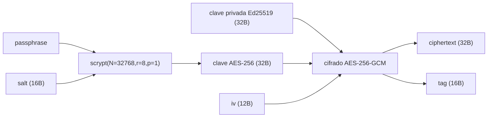

# radixdlt-keystore — Especificación del formato `key.json`

*[English](FORMAT.md) · **Español***

Estado: refleja `crates/keystore/src/lib.rs`. Este es el formato en disco de un
archivo de clave Ed25519 cifrado, **compatible con el `key.json` del Radix SSH
signer**, de modo que los archivos existentes siguen funcionando. El crate es
puro: nunca pide la passphrase, ni imprime, ni sale — quien llama aporta la
passphrase y gestiona la política de E/S.

---

## 1. Forma del archivo

```json
{
  "version": 1,
  "network": "stokenet",
  "networkId": 2,
  "publicKey": "<64 hex — clave pública Ed25519>",
  "address": "account_tdx_2_…",
  "createdAt": "<segundos unix>",
  "crypto": {
    "kdf": "scrypt",
    "salt": "<32 hex — 16 bytes>",
    "n": 32768,
    "r": 8,
    "p": 1,
    "iv": "<24 hex — 12 bytes>",
    "tag": "<32 hex — 16 bytes>",
    "ciphertext": "<64 hex — 32 bytes>"
  }
}
```

Los campos de nivel superior son **metadatos públicos** (derivados de la clave +
la red); solo `crypto` contiene el secreto. `address` es la dirección de cuenta
virtual derivada de `publicKey` para `networkId` (vía `radixdlt-address`).

---

## 2. Criptografía

- **KDF:** scrypt con `N = 2^15 = 32768`, `r = 8`, `p = 1`, longitud de salida
  32 bytes (constantes `SCRYPT_LOG_N=15`, `SCRYPT_R=8`, `SCRYPT_P=1`; paridad con
  el signer Node). Clave = `scrypt(passphrase, salt, N, r, p)`.
- **Cifrador:** AES-256-GCM, AAD vacío.
- **Tag separado:** AES-GCM produce `ciphertext ‖ tag`; el formato los guarda en
  campos hex **separados** (`ciphertext` = 32 bytes, `tag` = 16 bytes). Al
  descifrar se reconcatenan antes de llamar al AEAD.
- **Texto plano:** exactamente la clave privada Ed25519 de 32 bytes.



`salt` e `iv` son bytes aleatorios nuevos en cada `encrypt`.

---

## 3. Flujo de cifrado / descifrado

```mermaid
sequenceDiagram
    autonumber
    participant App as Llamante
    participant KF as KeyFile / CryptoBlob

    Note over App,KF: crear
    App->>KF: KeyFile::generate(networkId, passphrase) / from_private_key
    KF->>KF: deriva publicKey + address
    KF->>KF: CryptoBlob::encrypt(privKey, passphrase)  → salt, iv, ciphertext, tag
    KF-->>App: KeyFile
    App->>KF: save(path)  → JSON legible, 0600 en Unix

    Note over App,KF: desbloquear
    App->>KF: KeyFile::load(path)
    App->>KF: signing_key(passphrase) / private_key(passphrase)
    KF->>KF: scrypt(passphrase, salt) → clave AES
    KF->>KF: descifrado AES-256-GCM(ciphertext‖tag, iv)
    alt tag válido y 32 bytes
        KF-->>App: SigningKey / [u8;32]
    else passphrase incorrecta / manipulado
        KF-->>App: KeystoreError::WrongPassphraseOrCorrupt
    end
```

Al guardar, el archivo se escribe con salto de línea final y, en Unix, `chmod
0600` (solo propietario). `generate` pone a cero el buffer temporal del secreto
tras construir el archivo.

---

## 4. Modelo de errores (`KeystoreError`)

`Display` se localiza al idioma del sistema.

| Variante | Significado |
| --- | --- |
| `CorruptField(name)` | Un campo hex (`salt` / `iv` / `ciphertext` / `tag`) no es hex válido. |
| `WrongPassphraseOrCorrupt` | Falló la verificación del tag GCM (passphrase incorrecta o manipulación). |
| `UnexpectedKeyLength` | El texto plano descifrado no tiene 32 bytes. |
| `EncryptionFailed` | El cifrado AEAD falló inesperadamente. |
| `Io(e)` | Error de lectura/escritura del sistema de archivos. |
| `Json(e)` | El archivo no es JSON válido / forma incorrecta. |
| `Address(e)` | Falló la derivación de dirección (p. ej. network id desconocido). |

---

## 5. Notas de seguridad

- **Cifrado autenticado:** una passphrase incorrecta o cualquier manipulación de
  `ciphertext`/`tag`/`iv`/`salt` falla el tag GCM → `WrongPassphraseOrCorrupt`;
  nunca devuelve una clave errónea pero plausible.
- **En reposo:** solo `crypto` es secreto; el archivo es `0600` en Unix. El coste
  del KDF (`N=32768`) es la barrera contra fuerza bruta — la fortaleza de la
  passphrase es responsabilidad del llamante.
- **Interop:** el formato coincide con el `key.json` del Radix SSH signer, así
  que un archivo producido aquí se desbloquea allí y viceversa.
- **Deberes del llamante:** este crate no pide, ni registra, ni pone a cero la
  cadena de passphrase; gestiona la entrada/vida de la passphrase en el código
  llamante.
