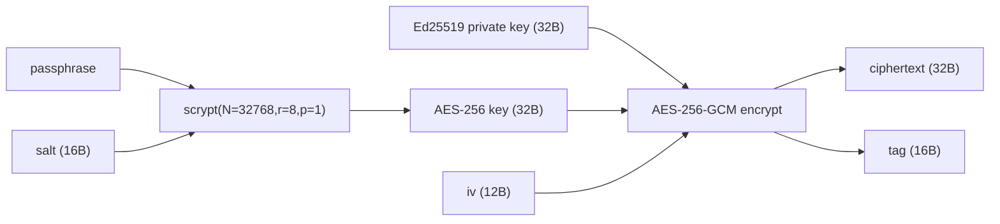

# radixdlt-keystore — `key.json` Format Specification

***English** · [Español](FORMAT.es.md)*

Status: reflects `crates/keystore/src/lib.rs`. This is the on-disk format of an
encrypted Ed25519 key file, **compatible with the Radix SSH signer's `key.json`**
so existing files keep working. The crate is pure: it never prompts for a
passphrase, prints, or exits — the caller supplies the passphrase and handles
I/O policy.

---

## 1. File shape

```json
{
  "version": 1,
  "network": "stokenet",
  "networkId": 2,
  "publicKey": "<64 hex chars — Ed25519 public key>",
  "address": "account_tdx_2_…",
  "createdAt": "<unix seconds>",
  "crypto": {
    "kdf": "scrypt",
    "salt": "<32 hex — 16 bytes>",
    "n": 32768,
    "r": 8,
    "p": 1,
    "iv": "<24 hex — 12 bytes>",
    "tag": "<32 hex — 16 bytes>",
    "ciphertext": "<64 hex — 32 bytes>"
  }
}
```

The top-level fields are **public metadata** (derived from the key + network);
only `crypto` holds the secret. `address` is the virtual account address derived
from `publicKey` for `networkId` (via `radixdlt-address`).

---

## 2. Cryptography

- **KDF:** scrypt with `N = 2^15 = 32768`, `r = 8`, `p = 1`, output length 32
  bytes (constants `SCRYPT_LOG_N=15`, `SCRYPT_R=8`, `SCRYPT_P=1`; parity with the
  Node signer). Key = `scrypt(passphrase, salt, N, r, p)`.
- **Cipher:** AES-256-GCM, empty AAD.
- **Split tag:** AES-GCM produces `ciphertext ‖ tag`; the format stores them as
  **separate** hex fields (`ciphertext` = 32 bytes, `tag` = 16 bytes). On
  decrypt they are re-concatenated before calling the AEAD.
- **Plaintext:** exactly the 32-byte Ed25519 private key.



`salt` and `iv` are fresh random bytes on every `encrypt`.

---

## 3. Encrypt / decrypt flow

```mermaid
sequenceDiagram
    autonumber
    participant App as Caller
    participant KF as KeyFile / CryptoBlob

    Note over App,KF: create
    App->>KF: KeyFile::generate(networkId, passphrase) / from_private_key
    KF->>KF: derive publicKey + address
    KF->>KF: CryptoBlob::encrypt(privKey, passphrase)  → salt, iv, ciphertext, tag
    KF-->>App: KeyFile
    App->>KF: save(path)  → pretty JSON, 0600 on Unix

    Note over App,KF: unlock
    App->>KF: KeyFile::load(path)
    App->>KF: signing_key(passphrase) / private_key(passphrase)
    KF->>KF: scrypt(passphrase, salt) → AES key
    KF->>KF: AES-256-GCM decrypt(ciphertext‖tag, iv)
    alt tag verifies & 32 bytes
        KF-->>App: SigningKey / [u8;32]
    else wrong passphrase / tampered
        KF-->>App: KeystoreError::WrongPassphraseOrCorrupt
    end
```

On save the file is written with a trailing newline and, on Unix, `chmod 0600`
(owner-only). `generate` zeroes the temporary secret buffer after building the
file.

---

## 4. Error model (`KeystoreError`)

`Display` is localized to the system language.

| Variant | Meaning |
| --- | --- |
| `CorruptField(name)` | A hex field (`salt` / `iv` / `ciphertext` / `tag`) is not valid hex. |
| `WrongPassphraseOrCorrupt` | GCM tag verification failed (bad passphrase or tampering). |
| `UnexpectedKeyLength` | Decrypted plaintext is not 32 bytes. |
| `EncryptionFailed` | AEAD encryption failed unexpectedly. |
| `Io(e)` | Filesystem read/write error. |
| `Json(e)` | File is not valid JSON / wrong shape. |
| `Address(e)` | Address derivation failed (e.g. unknown network id). |

---

## 5. Security notes

- **Authenticated encryption:** a wrong passphrase or any tampering with
  `ciphertext`/`tag`/`iv`/`salt` fails the GCM tag → `WrongPassphraseOrCorrupt`;
  it never returns a wrong-but-plausible key.
- **At rest:** only `crypto` is secret; the file is `0600` on Unix. The KDF cost
  (`N=32768`) is the brute-force barrier — the passphrase strength is the
  caller's responsibility.
- **Interop:** the format matches the Radix SSH signer's `key.json`, so a file
  produced here unlocks there and vice-versa.
- **Caller duties:** this crate does not prompt, log, or zeroize the caller's
  passphrase string; handle passphrase input/lifetime in the calling code.
