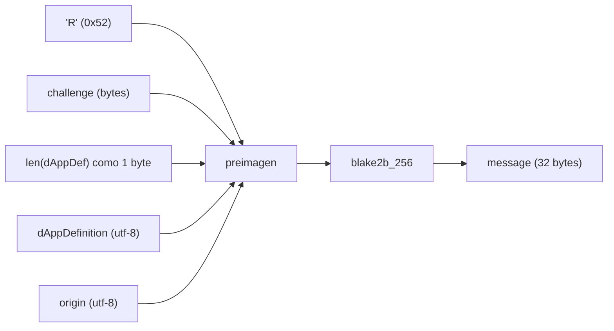
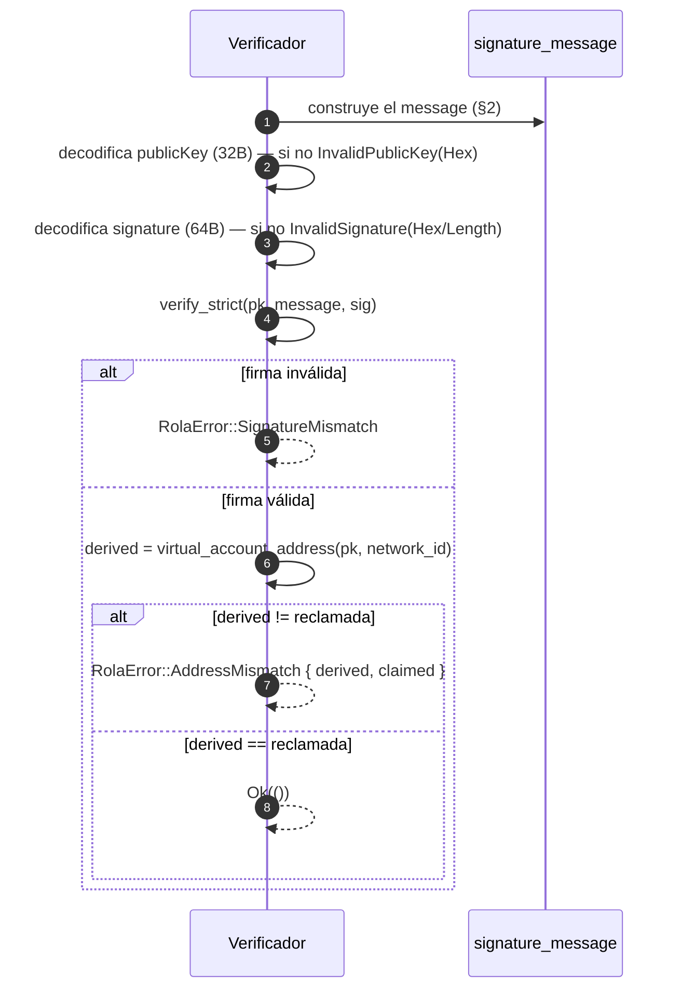

# radixdlt-rola — Especificación de la verificación ROLA

*[English](SPEC.md) · **Español***

Estado: refleja `crates/rola/src/lib.rs`. ROLA = **Radix Off-Ledger
Authentication** ("iniciar sesión con Radix"): una wallet prueba la propiedad de
una cuenta firmando un challenge, y el verificador comprueba la firma **y** que
la clave pública deriva a la dirección de cuenta reclamada. Este crate es un
reemplazo directo en Rust de `@radixdlt/rola`; el layout de bytes de abajo es el
contrato de interoperabilidad.

La prueba en sí viaja dentro de la interacción de prueba de cuenta — ver el
[esquema de interacción](../../connect-types/docs/SCHEMA.es.md#2-prueba-de-cuenta--rola-account_proof_request--account_proof_response).

---

## 1. Entradas

Una verificación toma un `AccountProof` más el contexto de la petición:

| Entrada | Significado |
| --- | --- |
| `challenge_hex` | El challenge de un solo uso de la dApp (hex), de la petición. |
| `dapp_definition` | La dirección de cuenta de definición de la dApp (string). |
| `origin` | El origen de la dApp (string, p. ej. `https://…` o `iroh://…`). |
| `network_id` | Red donde vive la cuenta (1 = mainnet, 2 = stokenet, …). |
| `AccountProof.address` | La dirección de cuenta (virtual) reclamada. |
| `AccountProof.public_key_hex` | Clave pública Ed25519 (32 bytes, hex). |
| `AccountProof.signature_hex` | Firma Ed25519 (64 bytes, hex). |

---

## 2. El mensaje firmado (`signature_message`)

Los bytes que se firman/verifican son un **digest blake2b-256** de una preimagen
con prefijos de longitud:

```
message = blake2b_256( preimagen )

preimagen =  0x52 ("R")               1 byte
           ‖ challenge                 (bytes crudos de challenge_hex)
           ‖ len(dAppDefinition)       1 byte   ← DEBE caber en un byte (≤ 255)
           ‖ dAppDefinition            bytes UTF-8
           ‖ origin                    bytes UTF-8
```



Notas fundamentadas en el código:

- El separador de dominio es el único byte `'R'` (0x52).
- `challenge_hex` se decodifica de hex a bytes crudos antes de hashear; hex
  inválido → `InvalidChallengeHex`.
- La definición de la dApp lleva como prefijo su **longitud en bytes como un
  único `u8`**. Si supera 255 bytes, la construcción falla con
  `DappDefinitionTooLong` (no hay prefijo de longitud en `challenge` ni en
  `origin`).
- La salida siempre son 32 bytes.

---

## 3. Predicado de verificación (`verify_account_proof`)

Una prueba es válida **si y solo si ambas** condiciones se cumplen:

```
ed25519_verify_strict(publicKey, message, signature) == OK
    Y
derive_virtual_account(publicKey, network_id) == direcciónReclamada
```



Ambas comprobaciones son obligatorias: una firma válida sobre la cuenta
equivocada, o una dirección que coincide con una firma incorrecta, se rechaza.

Detalles:

- La verificación de firma usa **`verify_strict`** (rechaza codificaciones no
  canónicas / puntos de orden pequeño), no el permisivo `verify`.
- La curva es Ed25519 / Curve25519 (el campo `curve` de la prueba es
  `"curve25519"`).
- La derivación de dirección se delega en
  [`radixdlt-address::virtual_account_address`](../../address).

---

## 4. Modelo de errores (`RolaError`)

`Display` se localiza al idioma del sistema.

| Variante | Causa |
| --- | --- |
| `InvalidChallengeHex(e)` | `challenge_hex` no es hex válido. |
| `DappDefinitionTooLong` | `dAppDefinition` supera los 255 bytes. |
| `InvalidPublicKeyHex(e)` | `public_key_hex` no es hex válido. |
| `InvalidPublicKey` | La clave pública no es de 32 bytes / no es un punto válido. |
| `InvalidSignatureHex(e)` | `signature_hex` no es hex válido. |
| `InvalidSignatureLength` | La firma no es de 64 bytes. |
| `SignatureMismatch` | La firma no verifica contra clave + mensaje. |
| `AddressMismatch { derived, claimed }` | La clave pública deriva a otra dirección. |
| `Address(e)` | Falló la derivación de dirección (p. ej. network id desconocido). |

---

## 5. Alcance y notas de seguridad

- **Solo cuentas virtuales.** Las cuentas con **claves de propietario rotadas**
  no pueden verificarse puramente off-ledger — requieren además una lectura del
  Gateway (una fase posterior). Este crate cubre el caso de cuenta virtual.
- **La frescura del challenge es responsabilidad del llamante.** ROLA prueba que
  la clave firmó *este challenge*; el verificador debe garantizar que el
  challenge fue de un solo uso y reciente para evitar replay.
- **Ligado a dApp + origen.** `dAppDefinition` y `origin` están dentro de la
  preimagen firmada, así que una prueba producida para una dApp/origen no
  verificará para otra.
- **Contrato de interoperabilidad.** El layout exacto de la preimagen del §2 es
  lo que lo hace un reemplazo directo de `@radixdlt/rola`; cambiar el orden de
  bytes, el prefijo `'R'` o el byte de longitud rompería la verificación entre
  implementaciones.
