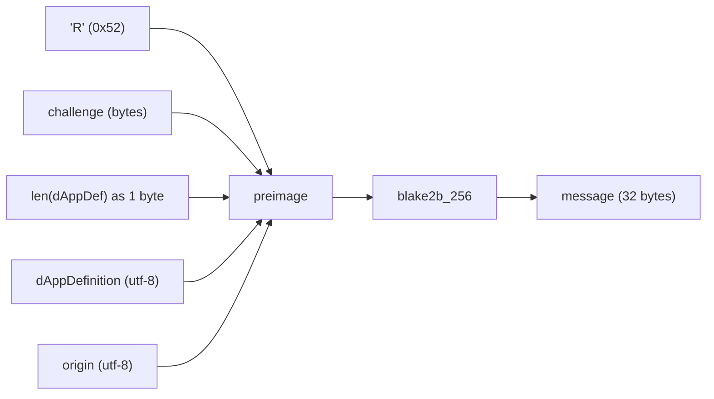
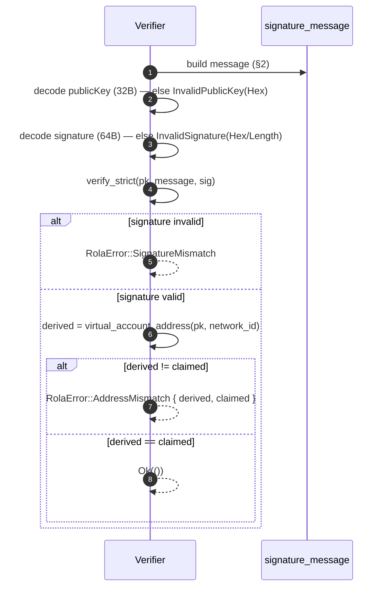

# radixdlt-rola — ROLA Verification Specification

***English** · [Español](SPEC.es.md)*

Status: reflects `crates/rola/src/lib.rs`. ROLA = **Radix Off-Ledger
Authentication** ("log in with Radix"): a wallet proves ownership of an account
by signing a challenge, and the verifier checks the signature **and** that the
public key derives to the claimed account address. This crate is a drop-in Rust
replacement for `@radixdlt/rola`; the byte layout below is the interop contract.

The proof itself travels inside the account-proof interaction — see the
[wallet-interaction schema](../../connect-types/docs/SCHEMA.md#2-account-proof--rola-account_proof_request--account_proof_response).

---

## 1. Inputs

A verification takes an `AccountProof` plus the request context:

| Input | Meaning |
| --- | --- |
| `challenge_hex` | The dApp's one-time challenge (hex), from the request. |
| `dapp_definition` | The dApp definition account address (string). |
| `origin` | The dApp origin (string, e.g. `https://…` or `iroh://…`). |
| `network_id` | Network the account lives on (1 = mainnet, 2 = stokenet, …). |
| `AccountProof.address` | The claimed (virtual) account address. |
| `AccountProof.public_key_hex` | Ed25519 public key (32 bytes, hex). |
| `AccountProof.signature_hex` | Ed25519 signature (64 bytes, hex). |

---

## 2. The signed message (`signature_message`)

The bytes that are signed/verified are a **blake2b-256 digest** of a
length-prefixed preimage:

```
message = blake2b_256( preimage )

preimage =  0x52 ("R")               1 byte
          ‖ challenge                 (raw bytes of challenge_hex)
          ‖ len(dAppDefinition)       1 byte   ← MUST fit in one byte (≤ 255)
          ‖ dAppDefinition            UTF-8 bytes
          ‖ origin                    UTF-8 bytes
```



Notes grounded in the code:

- The domain separator is the single byte `'R'` (0x52).
- `challenge_hex` is hex-decoded to raw bytes before hashing; invalid hex →
  `InvalidChallengeHex`.
- The dApp definition is prefixed by its **byte length as a single `u8`**. If it
  exceeds 255 bytes the build fails with `DappDefinitionTooLong` (there is no
  length prefix on `challenge` or `origin`).
- The output is always 32 bytes.

---

## 3. Verification predicate (`verify_account_proof`)

A proof is valid **if and only if both** hold:

```
ed25519_verify_strict(publicKey, message, signature) == OK
    AND
derive_virtual_account(publicKey, network_id) == claimedAddress
```



Both checks are mandatory: a valid signature over the wrong account, or a
matching address with a bad signature, is rejected.

Details:

- Signature verification uses **`verify_strict`** (rejects non-canonical
  encodings / small-order points), not the permissive `verify`.
- The curve is Ed25519 / Curve25519 (the proof's `curve` field is
  `"curve25519"`).
- Address derivation is delegated to
  [`radixdlt-address::virtual_account_address`](../../address).

---

## 4. Error model (`RolaError`)

`Display` is localized to the system language.

| Variant | Cause |
| --- | --- |
| `InvalidChallengeHex(e)` | `challenge_hex` is not valid hex. |
| `DappDefinitionTooLong` | `dAppDefinition` is longer than 255 bytes. |
| `InvalidPublicKeyHex(e)` | `public_key_hex` is not valid hex. |
| `InvalidPublicKey` | Public key is not 32 bytes / not a valid point. |
| `InvalidSignatureHex(e)` | `signature_hex` is not valid hex. |
| `InvalidSignatureLength` | Signature is not 64 bytes. |
| `SignatureMismatch` | Signature does not verify against key + message. |
| `AddressMismatch { derived, claimed }` | Public key derives to a different address. |
| `Address(e)` | Address derivation failed (e.g. unknown network id). |

---

## 5. Scope & security notes

- **Virtual accounts only.** Accounts with **rotated owner keys** cannot be
  verified purely off-ledger — they additionally require a Gateway read (a later
  phase). This crate covers the virtual-account case.
- **Challenge freshness is the caller's job.** ROLA proves the key signed *this
  challenge*; the verifier must ensure the challenge was one-time and recent to
  prevent replay.
- **Bind to dApp + origin.** `dAppDefinition` and `origin` are inside the signed
  preimage, so a proof produced for one dApp/origin will not verify for another.
- **Interop contract.** The exact preimage layout in §2 is what makes this a
  drop-in for `@radixdlt/rola`; changing byte order, the `'R'` prefix, or the
  length byte would break cross-implementation verification.
